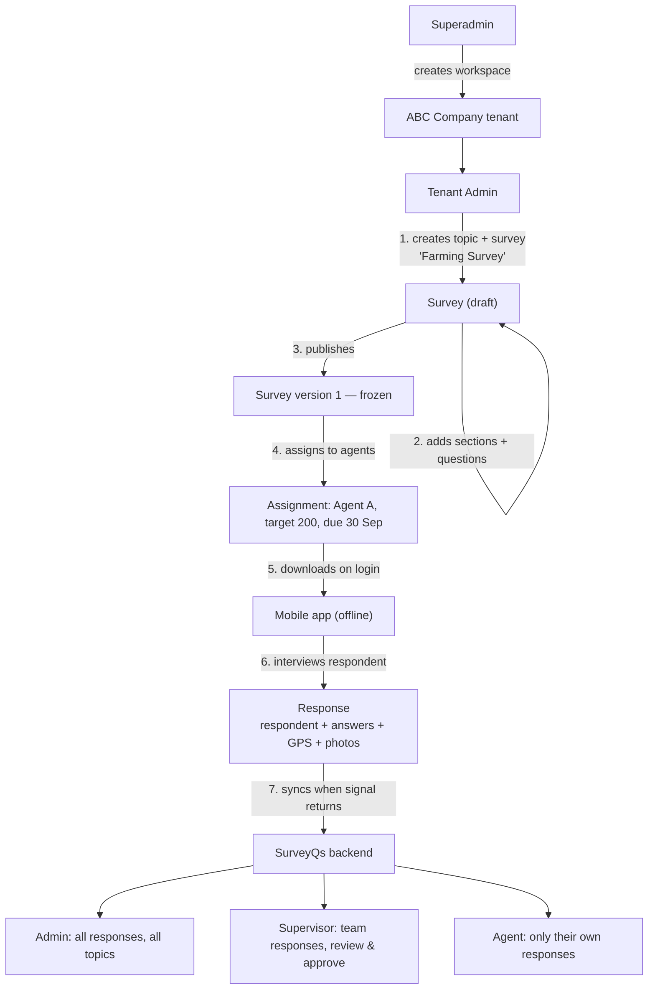
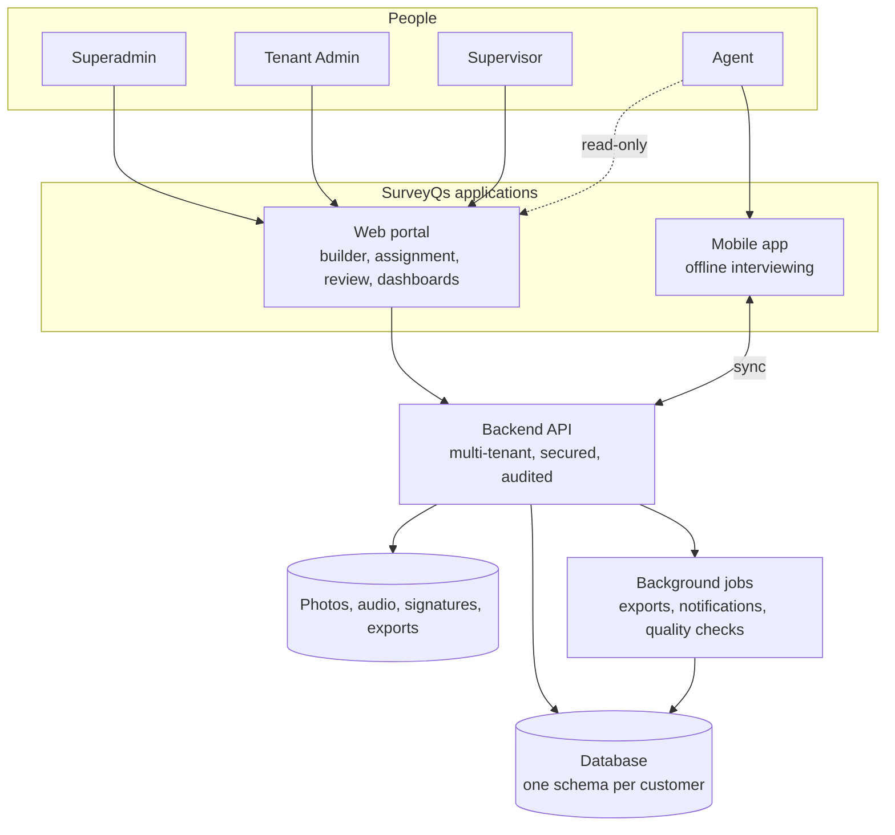

# SurveyQs — Overview

> **Audience & scope.** Managers, business stakeholders, and anyone evaluating the project who does not need to read code. It explains what SurveyQs is, who uses it, and how the pieces fit together — in plain English. For requirements with acceptance criteria, read [`product/FUNCTIONAL_SPEC.md`](./product/FUNCTIONAL_SPEC.md). For the technical design, start at [`architecture/ARCHITECTURE.md`](./architecture/ARCHITECTURE.md).

## The problem

Organisations that need to collect structured information from people — a cooperative surveying farmers about their practices, an appliance brand researching electronics buyers, a dealership studying car ownership — nearly always end up with one of three bad options:

1. **Paper forms.** Cheap to start, expensive to finish. Someone has to key in thousands of pages, and nobody can tell whether the interview actually happened.
2. **Generic online survey tools.** Fine when respondents fill the form themselves on good internet. Useless when a field agent is sitting in a village with no signal, and they offer nothing for managing a field team — who was assigned what, who has done how many, whose submissions look suspicious.
3. **A spreadsheet per project.** Every survey becomes a bespoke file with its own columns. Nothing is comparable, nothing is auditable, and the moment a question changes, the historical data stops lining up.

The specific gap SurveyQs fills is the middle of that list: **interviewer-administered surveys, collected offline, by a managed team, across many different survey topics, inside one system that an administrator can actually oversee.**

## What SurveyQs does

| Capability | What it means |
|---|---|
| **Custom survey builder** | An administrator creates a survey by giving it a title and a topic — "Farming Survey", "Electronics Survey", "Car Ownership Survey" — then adds as many questions as the survey needs, of any supported type, grouped into sections. No developer involved. |
| **Rich question types** | Text, numbers, single and multiple choice, dropdowns, ratings, Likert scales, NPS, matrix grids, ranking, dates, GPS location, photos, audio, signature, barcode scan, and more. See [`product/QUESTION_TYPES.md`](./product/QUESTION_TYPES.md). |
| **Smart forms** | Questions can appear only when relevant ("if the respondent owns a car, ask which model"), enforce their own validation ("age must be between 18 and 120"), calculate values, and repeat ("ask these four questions once per child"). |
| **Versioned surveys** | Publishing a survey freezes it. Editing it afterwards creates a new version, and every response stays attached to the version it was actually answered against — so historical data never silently changes meaning. |
| **Assignment to agents** | The administrator decides which agents get which survey, with optional targets ("collect 200 responses") and due dates. Agents see only what they are assigned. |
| **Works offline** | The mobile app downloads the survey once and then works with no connection at all. Interviews are saved on the device and sent automatically when signal returns. Nothing is lost, and nothing is submitted twice. |
| **Respondent records with consent** | Each interview captures who was interviewed — name, contact, location — and records their consent before any personal data is collected. |
| **Quality signals** | Every response carries GPS, timings, device and app details, so a supervisor can spot an interview that took 90 seconds when it should take twenty minutes. |
| **Review and approval** | Supervisors can review submissions, approve them, or send them back to the agent with a reason. |
| **Everything in one place** | The administrator sees all responses across all topics, filters by survey, agent, date, area or status, and exports to CSV or Excel. |
| **Multiple customers on one platform** | A superadmin creates a separate, fully isolated workspace for each customer company. One customer can never see another's data. |

## Who uses SurveyQs

Five distinct user types, each with a different view of the system.

| Role | What they do | Where they work |
|---|---|---|
| **Superadmin** | Runs the platform itself — creates a workspace (a *tenant*) for each customer company, provisions their first administrator, suspends or reactivates accounts, watches platform health. Never looks inside a customer's survey data. | Web, on the platform domain |
| **Tenant Admin** | Runs one customer's workspace — creates survey topics and surveys, builds the questions, publishes, assigns agents, invites users, sets roles, and sees **every response across every survey**. | Web, on that customer's subdomain |
| **Supervisor** | Manages a team of agents — assigns and reassigns work, watches progress against targets, reviews submissions, approves or rejects them. Sees their team's data only. | Web |
| **Agent** | Goes out and does the interviews. Sees **only the surveys assigned to them**, works offline, and sees **only the responses they collected**. | Mobile app (primary); a read-only web view |
| **Analyst / Viewer** | Reads dashboards and downloads exports. Changes nothing. Can optionally be restricted from seeing personal details. | Web |

The full capability matrix — exactly which role can do what, on which module — is in [`product/PERSONAS_AND_ROLES.md`](./product/PERSONAS_AND_ROLES.md).

## The core loop, end to end

Each numbered step maps to a screen and an endpoint; the mapping is in [`product/FUNCTIONAL_SPEC.md`](./product/FUNCTIONAL_SPEC.md).

## How the pieces fit together

**Three applications, one backend.** The web portal and the mobile app both talk to the same API. There is no separate mobile backend, so a rule enforced once is enforced everywhere.

## What makes this harder than it looks

Four things account for most of the engineering effort. They are called out here because they are where schedules usually slip.

**1. The form engine has to run in three places.** A question that says "only ask this if the respondent owns a car" must behave identically in the admin's preview on the web, in the agent's app on a phone with no signal, and on the server when the response finally arrives. Three implementations that drift is the classic failure mode of this product category. The design response is a single, deliberately small expression language, specified once in [`product/FORM_LOGIC.md`](./product/FORM_LOGIC.md), with the server as the only authority.

**2. Offline is not a feature you add later.** If the app assumes a connection anywhere in the interview flow, the whole design has to be unpicked. Every interview is saved on the device first and sent later; every submission carries an identifier the device generated, so a retry after a dropped connection updates the same record instead of creating a second one. This is specified in [`architecture/OFFLINE_SYNC.md`](./architecture/OFFLINE_SYNC.md).

**3. Changing a published survey must not corrupt old data.** If question 7 changes from "How many acres?" to "How many hectares?", every previously collected answer to question 7 is now wrong. SurveyQs solves this the way the established tools do: publishing freezes a version, editing creates a new one, and each response permanently remembers which version it was answered against.

**4. Answers are shaped differently in every survey, but reports need columns.** A survey's answers are, by definition, not a fixed set of database columns. The storage design — typed rows for analysis plus a document copy for fast reading — is explained with its reasoning in [`architecture/ANSWER_STORAGE.md`](./architecture/ANSWER_STORAGE.md).

## What SurveyQs is not

Saying this plainly now prevents scope arguments later.

- **Not a self-service web survey tool.** The primary mode is an agent interviewing a respondent in person. Public self-completion links are a possible later phase, not the product.
- **Not a panel or sample provider.** SurveyQs does not supply respondents. The customer brings their own list, or the agent recruits in the field.
- **Not a statistics package.** It produces clean, exportable, auditable data and straightforward dashboards. Weighting, significance testing and modelling happen in the customer's analysis tool of choice.
- **Not a CRM.** Respondent records exist to support the interview and to deduplicate. They are not a sales pipeline.

## Where the design comes from

Two sources, both deliberate.

**Established practice in field data collection.** The question-type catalogue, the skip-logic and validation model, the version-pinning rule, and the quality-metadata approach all follow what the mature tools in this space converged on — ODK and XLSForm, KoboToolbox, SurveyCTO, SurveyJS, Form.io and Qualtrics. Every borrowed decision is recorded with its source in [`reference/RESEARCH_NOTES.md`](./reference/RESEARCH_NOTES.md), so a reviewer can check the reasoning rather than take it on trust.

**A working production system.** The multi-tenant, role-based, offline-first plumbing is modelled on Crediqs — an existing platform with the same shape: a superadmin creating tenants, administrators on the web, field agents on an offline Android app. Reusing those patterns removes most of the risk from everything that is not the survey engine itself. What is reused, what is generalized, and what is genuinely new is itemised in [`architecture/REUSE_FROM_CREDIQS.md`](./architecture/REUSE_FROM_CREDIQS.md).

## Delivery in brief

Four phases, with the cut line for a usable first release drawn after Phase 2.

| Phase | Outcome |
|---|---|
| **1 — Foundation** | Tenants, users, roles, login. An admin can log in; a superadmin can create a customer workspace. |
| **2 — Core survey loop (MVP)** | Build a survey with the common question types, publish it, assign it to an agent, collect responses offline on mobile, sync, and view and export them on the web. **This is the first genuinely useful release.** |
| **3 — Depth** | Skip logic, full validation, the remaining question types, repeat groups, review and approval, quality flags, dashboards. |
| **4 — Scale** | Quotas, bulk respondent import, advanced analytics, public links if wanted, PDF reports. |

Detail, sequencing and effort bands are in [`ROADMAP.md`](./ROADMAP.md).

---

*Last reviewed: 2026-09-11. Source of truth: [`product/FUNCTIONAL_SPEC.md`](./product/FUNCTIONAL_SPEC.md).*
