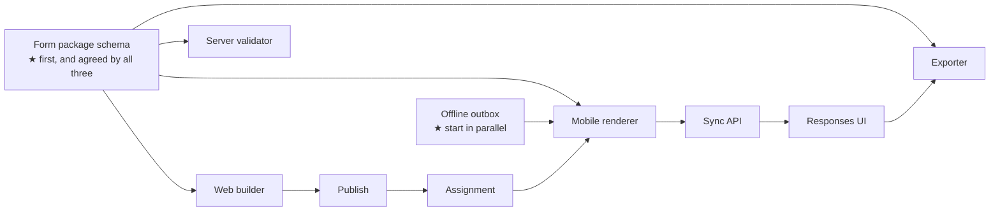

# Roadmap

> **Audience & scope.** Whoever is planning, funding or sequencing this build. Four phases, what each delivers, why the MVP line sits where it does, and where the risk is. Requirements are numbered in [`product/FUNCTIONAL_SPEC.md`](./product/FUNCTIONAL_SPEC.md); the reuse analysis that drives the estimates is in [`architecture/REUSE_FROM_CREDIQS.md`](./architecture/REUSE_FROM_CREDIQS.md).

## The shape of the estimate

Roughly **70% of SurveyQs is plumbing with a working reference implementation** — tenancy, provisioning, auth, roles, audit, imports, notifications, the offline outbox, the table and form patterns, the mobile primitives. That work is well understood and predictable.

The other **30% is the form engine**, and it is where a schedule is won or lost. Put the strongest engineers there and let the plumbing follow the proven patterns.

Effort bands below are in engineer-weeks for a team of three (one backend, one web, one mobile) with design support. They are planning bands, not commitments.

---

## Phase 1 — Foundation

**Outcome:** a superadmin can create a workspace; an administrator can sign in and manage users. No surveys yet.

| Work | Band |
|---|---|
| Repository, environments, CI, deploy pipeline | 2 |
| Tenancy: middleware, models, provisioning, per-tenant migrations | 3 |
| Auth: tokens, login, reset, workspace picker, cross-subdomain hand-off | 3 |
| Roles and permissions: modules, roles, matrix, scoping helpers | 2 |
| Web shell, navigation, tables, drawers, permission gate | 3 |
| Superadmin area: tenant list, create, modules, deactivate | 2 |
| User management: invite, activate, roles, teams | 2 |
| Audit log | 1 |
| **Total** | **~18 weeks** |

**Definition of done:** a superadmin creates ABC Company; its administrator activates their account, invites a supervisor and two agents, and assigns each agent to the supervisor. Nothing survey-related exists yet, and the tenant-isolation test passes in CI.

**Risk:** low. Every piece has a working reference.

---

## Phase 2 — The core survey loop *(MVP)*

**Outcome:** the complete loop from your brief. An admin builds a survey with questions, publishes it, assigns it to agents; agents collect offline on mobile and sync; the admin sees and exports every response across every topic.

| Work | Band |
|---|---|
| Categories, surveys, versions, sections, questions, choice lists | 3 |
| **The form package schema** and the publish pipeline | 2 |
| The survey builder: three panes, drag reorder, per-type property panels | 5 |
| Web preview renderer | 2 |
| Assignments: model, API, assignment screen, progress | 2 |
| Respondents: model, deduplication, consent capture and notices | 3 |
| Response submission pipeline: idempotency, validation, hybrid storage | 3 |
| **Mobile: the form renderer and the widget registry** (15 MVP types) | 6 |
| Mobile: shell, login, assigned surveys, respondent, consent, review, my work | 4 |
| **Mobile: the offline outbox, replayer and Sync Review** | 4 |
| Sync API: bootstrap, assignments, packages, batch, attachments | 3 |
| Responses list and detail on the web | 3 |
| Export: CSV and Excel with the full column encoding | 2 |
| Basic dashboard | 2 |
| **Total** | **~44 weeks** |

**Definition of done — trace this exactly:**

> The admin creates "Farming Survey" under the Farming category, adds two sections and eleven questions, previews it, publishes version 1, and assigns it to Agent A with a target of 200. Agent A opens the app, downloads the form, **puts the phone in airplane mode**, records a respondent, captures consent, answers all eleven questions, takes a photo, and submits. The phone is force-stopped and rebooted. Connectivity is restored. The response and its photo arrive exactly once. The admin finds it filtered by the Farming category, opens it, sees every answer and the photo, and exports it to Excel. Agent A sees only their own response.

**What is deliberately excluded from the MVP**

| Excluded | Why it can wait |
|---|---|
| Skip logic | A linear survey is genuinely useful. Conditional logic is the largest single piece of new work and should not gate first value. |
| Review and approval | Submitted is a perfectly good terminal state for a first release. |
| Repeat groups, matrix, ranking, NPS | The 15 MVP question types cover a real farming, electronics or car survey end to end. |
| Quality flags | Duration is recorded from day one; flagging on it comes later. |
| Quotas, bulk import, PDF, cross-tabs | None of them block a first live survey. |

**Risk:** the mobile form renderer and the outbox. Both are on the critical path and both are hard to retrofit, which is why they carry the largest bands.

---

## Phase 3 — Depth

**Outcome:** a serious field-survey product rather than a capable form tool.

| Work | Band |
|---|---|
| **The expression engine**: lexer, parser, evaluator in TypeScript and Python, shared fixture table | 4 |
| Skip logic end to end: builder, preview, mobile, server re-validation | 3 |
| Validation: constraints, messages, client-side enforcement | 2 |
| The logic editor: condition builder, autocomplete, test panel | 3 |
| Repeat groups: schema, builder, mobile instance list, export shapes | 4 |
| The remaining P3 question types | 4 |
| Cascading choices | 2 |
| Review and approval: states, dialogs, rejection round trip to the device | 3 |
| Quality flags: rules, evaluation, supervisor dashboard | 3 |
| Team and area assignment | 2 |
| Per-question summary reports with cross-version rules | 3 |
| Consent withdrawal, anonymisation, PII masking | 2 |
| Two-factor, session management, custom roles | 2 |
| Background exports, notification preferences | 2 |
| **Total** | **~39 weeks** |

**Risk:** the expression engine is the highest-risk item in the whole project, because a divergence between the three runtimes is silent. The shared fixture table is the mitigation and must be built *first*, before any of the three implementations.

---

## Phase 4 — Scale

**Outcome:** the things customers ask for once they are running at volume.

| Work | Band |
|---|---|
| Quotas | 3 |
| Respondent bulk import | 2 |
| Audio audits | 3 |
| Multilingual surveys | 4 |
| Survey import and export as a spreadsheet | 3 |
| Version diff | 2 |
| Cross-tabulation and scheduled reports | 4 |
| PDF reports | 3 |
| A read-only data API for BI tools | 2 |
| iOS | 4 |
| Remaining P4 question types | 3 |
| Resumable uploads, partitioning, performance | 3 |
| **Total** | **~36 weeks** |

Phase 4 is a menu, not a plan. Pick from it based on what real customers ask for.

---

## Sequencing within the MVP

Order matters more than usual here, because three streams depend on one artefact.

**Two rules for the MVP:**

1. **Freeze the form package schema in week one**, with all three implementers in the room. Every other stream reads it. Changing it in week twelve is three simultaneous rewrites.
2. **Build the offline outbox in parallel with the renderer, not after it.** Retrofitting offline behaviour into a renderer that assumed a connection means rewriting the renderer.

---

## Risk register

| Risk | Impact | Likelihood | Mitigation |
|---|---|---|---|
| **The three evaluator runtimes diverge** | Severe — silent data loss | High without mitigation | Build the shared fixture table before any implementation; run it in both CI jobs; make a divergence fail the build |
| **Offline sync loses work** | Severe — destroys trust permanently | Medium | Reuse the proven outbox design; test with force-stops, reboots and 2G; never claim "submitted" before the server confirms |
| **The builder is too hard for a non-technical admin** | High — the product is unusable by its buyer | Medium | Test with three real administrators at the end of Phase 2, before the logic editor is designed |
| **The form package outgrows a phone** | Medium | Medium | Warn in the builder above thresholds; cap choice-list sizes |
| **A version change corrupts historical meaning** | Severe — the dataset becomes indefensible | Low if pinning is correct | Pin at submission; never migrate an open draft; warn on value changes; test cross-version reporting explicitly |
| **Per-tenant migrations make deploys unmanageable** | Medium | Medium | Additive migrations, background backfills, staging with several tenants including a not-ready one |
| **Scope creep into analytics** | Medium | **High** | Written into [`OVERVIEW.md`](./OVERVIEW.md): SurveyQs collects well and exports cleanly. Analysis happens downstream. |

The last row is the one that most often derails products of this shape. Every customer will ask for one more chart. The answer is a clean export and a read-only API.

---

## Team shape

| Phase | Backend | Web | Mobile | Design | QA |
|---|---|---|---|---|---|
| 1 | 1.5 | 1 | 0 | 0.25 | 0.25 |
| 2 | 1.5 | 1.5 | 1.5 | 0.5 | 0.5 |
| 3 | 1.5 | 1.5 | 1 | 0.5 | 1 |
| 4 | 1 | 1 | 1 | 0.25 | 0.5 |

Two notes. Mobile joins at Phase 2 and is on the critical path from day one of it. QA rises in Phase 3 because skip logic multiplies the number of paths through a survey and manual coverage stops being feasible.

---

## What to build first, in one line

**The form package schema.** Everything else reads it, and it is the cheapest thing in the project to get right early and the most expensive to change late.

---

*Last reviewed: 2026-09-11. Bands are planning estimates, not commitments, and should be re-derived once the team is known.*
