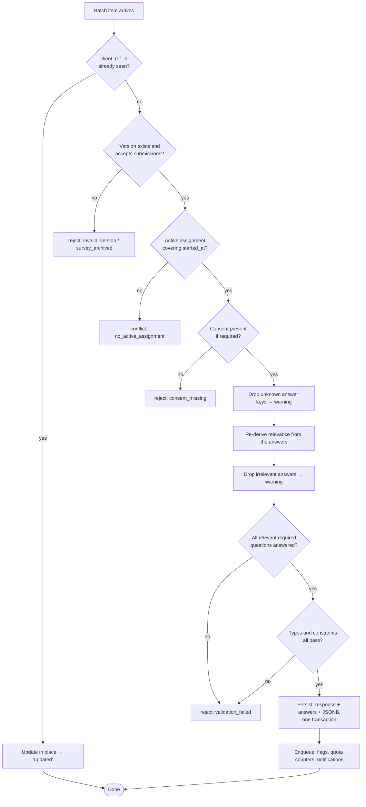

# Sync API

> **Audience & scope.** Mobile and backend engineers. The complete wire contract between an offline device and the server: what it pulls, what it pushes, and every way a push can fail. The client-side machinery is in [`../architecture/OFFLINE_SYNC.md`](../architecture/OFFLINE_SYNC.md); general conventions are in [`API_CONVENTIONS.md`](./API_CONVENTIONS.md).

## Why these endpoints are separate

The mobile app could call `/api/responses/` and `/api/respondents/` directly. It does not, and the reason is that an offline client has requirements a browser does not:

- It needs to know **what changed** since last time, not to refetch everything.
- It needs **idempotency** on every write.
- It needs errors that are **machine-classifiable**, so the replayer can decide between retry, fail and ask-a-human without parsing English.
- It needs to push a **chain** — respondent, consent, response, attachments — where each step may be days old.

The `/api/sync/` endpoints are a thin, purpose-built facade over the same services the web endpoints use. They are not a second implementation of the business rules.

---

## Pull

### `GET /api/sync/bootstrap/`

One call on sign-in and on demand. Everything the app needs to start working, so a cold start over a weak connection is one round trip rather than six.

```json
← 200 {
  "user":        { "id": "…", "full_name": "Agent A", "email": "…" },
  "permissions": { "role_code": "agent", "modules": [...], "permissions": {...} },
  "tenant":      { "name": "ABC Company", "subdomain": "abc",
                   "date_format": "DD/MM/YYYY", "timezone": "Asia/Kolkata" },
  "settings":    { "attachment_limits": { "image": 5242880, "audio": 10485760 },
                   "gps_accuracy_default_m": 50,
                   "draft_retention_days": 30 },
  "assignments": [ … as below … ],
  "consent_notices": [ { "id": "…", "version": 3, "language": "mr", "text": "…" } ],
  "server_time": "2026-09-10T09:00:00Z"
}
```

`server_time` lets the device detect a badly wrong clock and flag it, rather than silently submitting responses stamped in 1970.

### `GET /api/sync/assignments/`

```json
← 200 {
  "assignments": [
    {
      "id": "asg-uuid",
      "survey": { "id": "…", "title": "Farming Survey",
                  "category": { "code": "farming", "label": "Farming" } },
      "version": { "id": "ver-uuid", "version_number": 2,
                   "schema_hash": "sha256:9c1e…", "size_bytes": 48213 },
      "target_count": 200,
      "submitted_count": 142,
      "due_date": "2026-09-30",
      "priority": "normal",
      "instructions": "Focus on households with more than 2 acres.",
      "status": "active",
      "survey_status": "published"
    }
  ],
  "revoked_assignment_ids": ["asg-old-uuid"],
  "server_time": "…"
}
```

`schema_hash` is the whole point: the device compares it with what it holds and downloads nothing when they match. `revoked_assignment_ids` lets the app remove a survey from the home screen and prune its cached package.

`size_bytes` lets the app warn before pulling a 3 MB package over a metered connection.

### `GET /api/sync/packages/{version_id}/`

Returns the frozen form package defined in [`../architecture/FORM_SCHEMA.md`](../architecture/FORM_SCHEMA.md).

```
Request headers:
  If-None-Match: "sha256:9c1e…"
  X-Schema-Version: 1.0

← 304 Not Modified          (the device already has it)
← 200 <the package JSON>    ETag: "sha256:9c1e…"  Cache-Control: immutable
← 409 { "code": "upgrade_required",
        "detail": "This form needs app version 1.6 or later.",
        "min_app_version": "1.6.0" }
```

A version is immutable, so its package can be cached forever. The `409` exists so a device that cannot read a newer schema version is **told**, rather than rendering a form with questions it silently dropped.

### `GET /api/sync/respondents/?updated_after=&geography=`

A lightweight slice for offline duplicate detection — identifiers and display names only, never full records.

```json
← 200 {
  "respondents": [
    { "id": "…", "full_name": "Ramesh Patil", "phone": "+919876543210",
      "identity_number": "…", "geography_node_id": "…",
      "consent_status": "granted", "updated_at": "…" }
  ],
  "next_cursor": "…",
  "server_time": "…"
}
```

Cursor-paginated and filtered to the agent's area, because a tenant with 60,000 respondents must not ship all of them to every phone.

---

## Push

### `POST /api/sync/batch/`

The primary write endpoint. Accepts a chain of items in dependency order and processes them **in order, each in its own transaction**, so one failure does not roll back the successes before it.

```json
→ {
  "items": [
    { "ref": "a1", "kind": "respondent.create",
      "payload": { "client_ref_id": "a1", "full_name": "Ramesh Patil",
                   "phone": "+919876543210", "geography_node": "…" } },

    { "ref": "b1", "kind": "consent.create", "parent_ref": "a1",
      "payload": { "client_ref_id": "b1", "notice_id": "…", "language": "mr",
                   "method": "verbal_confirmed", "granted_at": "…",
                   "captured_offline": true } },

    { "ref": "c1", "kind": "response.submit", "parent_ref": "a1",
      "payload": { "client_ref_id": "c1", "survey_id": "…",
                   "survey_version_id": "…", "assignment_id": "…",
                   "started_at": "…", "submitted_at": "…", "duration_seconds": 1359,
                   "gps": { "lat": 19.07609, "lng": 72.877426, "accuracy_m": 8.4,
                            "captured_at": "…" },
                   "device": { "id": "…", "app_version": "1.4.2", "os": "Android 13" },
                   "was_offline": true,
                   "answers": { … },
                   "attachments": [ { "ref": "att-1", "question_code": "plot_photo",
                                      "kind": "image", "filename": "plot.jpg",
                                      "size_bytes": 418233, "checksum": "sha256:…" } ] } }
  ]
}
```

```json
← 200 {
  "results": [
    { "ref": "a1", "status": "created",  "id": "resp-server-uuid" },
    { "ref": "b1", "status": "created",  "id": "cons-server-uuid" },
    { "ref": "c1", "status": "created",  "id": "response-server-uuid",
      "response_code": "RESP-2026-004821",
      "warnings": [ { "code": "irrelevant_answer_dropped",
                      "question_code": "car_model",
                      "detail": "Question was not relevant; the answer was not stored." } ],
      "attachment_uploads": [ { "ref": "att-1",
                                "upload_url": "/api/sync/attachments/",
                                "attachment_id": "att-server-uuid" } ] }
  ],
  "server_time": "…"
}
```

Per-item `status` is one of `created`, `updated` (an idempotent retry), `rejected` or `conflict`. The replayer maps each directly onto an outbox state.

An item whose `parent_ref` failed is **not attempted**; it returns `skipped` with the parent's ref, and the replayer leaves it pending for the next flush once the parent is resolved.

Maximum 50 items per batch. A device with 200 queued responses sends several batches, which is also what keeps a single request from timing out on a weak connection.

### `POST /api/sync/attachments/`

Multipart, one file per request, referencing an already-created response.

```
→ multipart/form-data
    response_id:    <uuid>
    client_ref_id:  <uuid>
    question_code:  plot_photo
    kind:           image
    checksum:       sha256:…
    captured_at:    2026-09-10T09:20:30Z
    file:           <binary>

← 201 { "id": "att-uuid", "status": "stored", "url": "<signed>" }
← 200 { "id": "att-uuid", "status": "already_stored" }     ← idempotent retry
← 400 { "code": "checksum_mismatch", "detail": "The uploaded file did not match its checksum." }
← 413 { "code": "file_too_large",   "detail": "Maximum 5 MB for images.", "max_bytes": 5242880 }
← 415 { "code": "unsupported_type", "detail": "File type not permitted for this question." }
```

Attachments are uploaded **after** their response exists, one at a time, sequentially per response. Parallel uploads on a weak connection tend to fail together and race the rate limit.

### `POST /api/sync/heartbeat/`

Optional, cheap, and worth having.

```json
→ { "device_id": "…", "app_version": "1.4.2", "pending_count": 9,
    "oldest_pending_at": "2026-09-08T14:02:00Z" }
← 200 { "server_time": "…", "has_updates": true }
```

Two things it buys: a supervisor can see "Agent B has 9 items queued and has not synced in five days" **before** a week of fieldwork is at risk, and `has_updates` tells the app to pull assignments without polling the heavier endpoint.

---

## Error vocabulary

Every failure carries a machine-readable `code`. This is a fixed vocabulary; adding to it is an API change, and the client treats an unknown code as a generic retryable failure rather than crashing.

### Rejections — permanent, do not retry

| Code | Cause | The app should |
|---|---|---|
| `validation_failed` | A relevant required question is missing, or a constraint failed | Show which question; offer to reopen for editing |
| `unknown_question` | An answer references a code not in the pinned version | Fail the item; report a bug |
| `invalid_version` | The version does not exist or does not belong to the survey | Fail; refresh assignments |
| `survey_archived` | The survey is archived | Fail; tell the agent to contact their supervisor |
| `consent_missing` | Consent required but absent | Fail; the interview cannot be recovered |
| `checksum_mismatch` | The file did not arrive intact | Retry **once** with a fresh read, then fail |
| `file_too_large` / `unsupported_type` | | Fail; should have been caught at capture |
| `quota_full` | An enforced quota cell is full | Fail with an explanation |

```json
← 422 {
  "ref": "c1", "status": "rejected", "code": "validation_failed",
  "detail": "2 questions failed validation.",
  "errors": [
    { "question_code": "age", "code": "constraint_failed",
      "message": "Age must be between 18 and 120.", "value": 210 },
    { "question_code": "crop", "code": "required_missing",
      "message": "This question is required." }
  ]
}
```

### Conflicts — a human must decide

| Code | Cause | Resolutions offered |
|---|---|---|
| `duplicate_respondent` | Phone or identity number already exists | Merge (default), keep both, discard |
| `duplicate_response` | One-per-respondent, and one exists | Discard, or replace |
| `no_active_assignment` | The assignment was revoked before this response started | Discard, or escalate |
| `survey_closed` | Closed more than the grace window ago | Discard, or escalate |

```json
← 409 {
  "ref": "a1", "status": "conflict", "code": "duplicate_respondent",
  "detail": "A respondent with this phone number already exists.",
  "existing": { "id": "…", "full_name": "Ramesh Patil",
                "phone": "+9198765•••10", "created_at": "2026-03-04T…" },
  "resolutions": ["merge", "keep_both", "discard"]
}
```

The device resolves by re-sending with `resolution` set:

```json
→ { "items": [ { "ref": "a1", "kind": "respondent.create",
                 "resolution": "merge", "merge_into": "existing-uuid",
                 "payload": { … } } ] }
```

### Retryable — leave pending

| Code | Cause |
|---|---|
| `401` | Token expired. Refresh, then retry. **Never fail the item.** |
| `429` | Throttled. Honour `Retry-After`. |
| `500` / `502` / `503` | Server-side. Back off and retry. |
| No response at all | Network. Mark offline; retry. |

The `401` case deserves its own emphasis: it must produce a token refresh and a retry, never a failed item. A misrouted request returning `404` where it should return `401` is what causes a replayer to mark real fieldwork as permanently dead, and it is why the tenant middleware's behaviour on an undecodable token is specified so carefully in [`../architecture/MULTI_TENANCY.md`](../architecture/MULTI_TENANCY.md).

---

## Server-side submission pipeline

Ten steps, in order, stopping at the first failure that makes the rest meaningless.



Two properties to hold onto:

- **Steps F and H produce warnings, not rejections.** A client that submits an answer to a question the server judges irrelevant is out of step with the server, not malicious. The answer is dropped, the fact is reported, and the response is stored — losing an entire interview over one stray key would be a terrible trade.
- **Step K is one transaction.** The response row, the answer rows and the JSONB document are written together or not at all. See [`../architecture/ANSWER_STORAGE.md`](../architecture/ANSWER_STORAGE.md).

---

## A complete flush

```mermaid
sequenceDiagram
    autonumber
    participant D as Device
    participant S as Server

    D->>S: GET /api/sync/assignments/
    S-->>D: 3 assignments; one has a new schema_hash
    D->>S: GET /api/sync/packages/{new_version}/  (If-None-Match)
    S-->>D: 200 + package
    D->>S: POST /api/sync/batch/  (items 1–50)
    S-->>D: 48 created, 1 updated (a retry), 1 conflict
    D->>D: mark 49 done; surface the conflict in Sync Review
    D->>S: POST /api/sync/attachments/  ×37, sequentially
    S-->>D: 201 each
    D->>S: POST /api/sync/batch/  (items 51–92)
    S-->>D: all created
    D->>S: POST /api/sync/heartbeat/  {pending_count: 0}
    S-->>D: 200
    D->>D: toast — "All work synced ✓"
```

---

## Rate limits

| Endpoint | Limit |
|---|---|
| `sync/batch/` | 120 per minute per user |
| `sync/attachments/` | 300 per minute per user |
| `sync/assignments/`, `sync/bootstrap/` | 60 per minute per user |
| `sync/heartbeat/` | 120 per minute per user |

Generous by design. An agent returning from a week offline may legitimately push two hundred responses and four hundred files in one session, and throttling honest fieldwork costs more than the load it saves. `429` responses carry `Retry-After`, and the replayer honours it.

---

*Last reviewed: 2026-09-11. Source of truth: the sync views and their test suite. Every code in the error vocabulary has a test asserting both the status and the code.*
