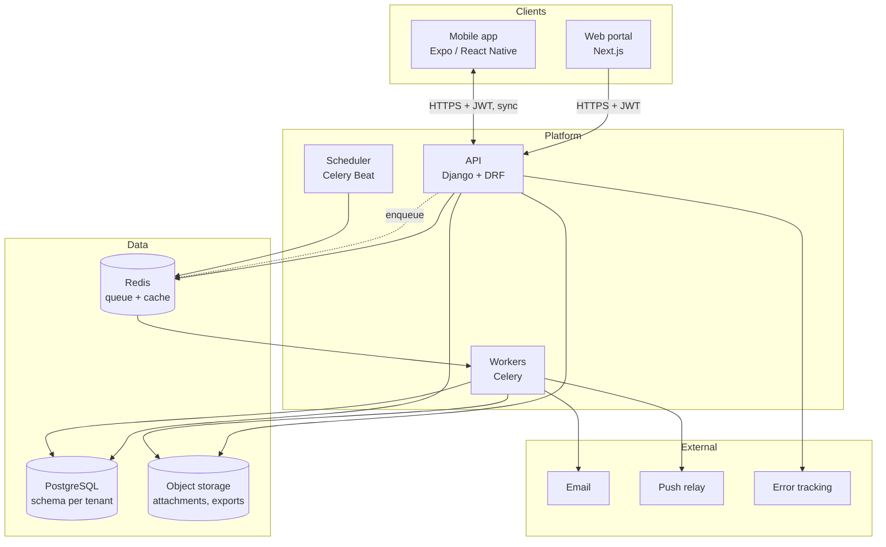
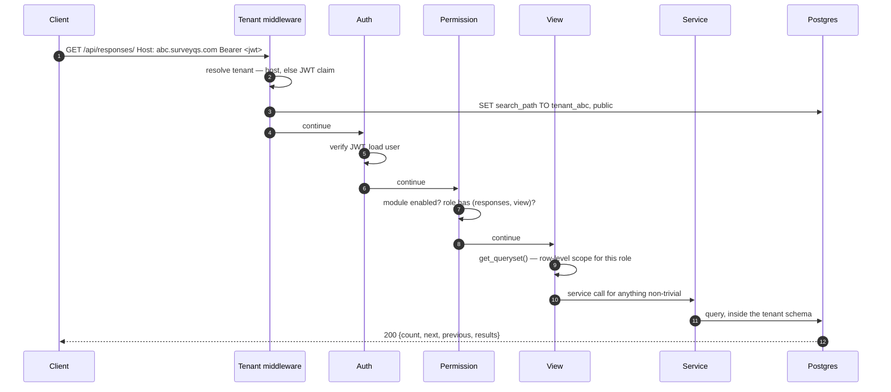
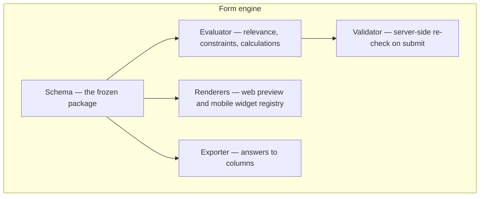

# Architecture

> **Audience & scope.** Engineers joining the project. System context, the stack, how a request flows, and the reasoning behind the structural choices. Deeper dives live in the sibling documents linked throughout.

## System context



**One backend, two clients.** The mobile app has no separate API. A rule enforced once — an agent sees only their own responses — is enforced for both surfaces, because there is only one place it is written.

## The stack

| Layer | Choice | Why |
|---|---|---|
| API | **Django 5 + Django REST Framework** | The tenancy, RBAC, audit and import machinery being reused is Django. Rewriting it in another stack trades a known quantity for an unknown one. |
| Tenancy | **django-tenants**, schema per tenant | Isolation enforced by Postgres rather than by remembering a filter. See [`MULTI_TENANCY.md`](./MULTI_TENANCY.md). |
| Database | **PostgreSQL 15+** | JSONB with GIN indexing, partial unique indexes, and real schemas are all load-bearing. |
| Async | **Celery + Redis** | Exports, notification fan-out, quality-flag evaluation, tenant provisioning follow-ups. |
| Auth | **JWT**, short access + rotating refresh | Stateless, works identically for a browser and an offline-capable app. |
| Web | **Next.js 14 App Router, TypeScript** | Matches the existing portal so its patterns transfer directly. |
| Web UI | **Tailwind + vendored shadcn/ui on Radix** | Owned source, no CLI dependency, accessible primitives. |
| Web state | **TanStack Query v5** | Server state is the only state that matters here. No global store. |
| Web forms | **react-hook-form + zod** | Zod schemas are shared with mobile, so both validate identically. |
| Mobile | **Expo + React Native + NativeWind** | Same language as web, real offline primitives, over-the-air config, Android-first. |
| Mobile storage | **Encrypted key-value store** for the outbox and cache | Durable across restarts; encrypted at rest. |
| Shared | A TypeScript package used by web and mobile | Types, the API client, zod schemas, **and the expression evaluator**. |

### The shared package earns its place

```
shared/
├── api-client/      one HTTP client: token refresh, retry, tenant routing
├── api-types/       generated from the OpenAPI schema
├── validation/      zod schemas — web and mobile validate identically
├── expression/      the form-logic evaluator  ← the important one
└── constants/       roles, modules, question types, status enums
```

`expression/` is the reason this package is not optional. The evaluator must behave identically on both clients, and the only reliable way to guarantee that is for there to be one implementation. The server has a second implementation in Python — unavoidable — and the two are held together by a shared table of test cases that both CI jobs run. See [`../product/FORM_LOGIC.md`](../product/FORM_LOGIC.md).

## Request lifecycle



Five gates, each with one job:

1. **Tenant resolution** — which schema. Host first; JWT `tenant_schema` claim as the fallback, which is how a single-host mobile client works.
2. **Authentication** — who.
3. **Permission** — may this role perform this action on this module. Fails closed if a view forgets to declare either.
4. **Row-level scoping** — which records, applied in the queryset so the database returns less, not so the client filters more.
5. **Service layer** — business rules. Views orchestrate; services own invariants.

Gates 3 and 4 are separate mechanisms and both are needed. An agent *has* `view` on responses; scoping is what limits that to their own. See [`AUTH_AND_RBAC.md`](./AUTH_AND_RBAC.md).

## Backend structure

```
backend/
├── surveyqs/settings/{base,development,production,test}.py
└── apps/
    ├── core/            base models, tenant middleware and context, pagination,
    │                    exception handler, throttling, file validation, mixins
    ├── tenants/         Tenant, Domain, provisioning commands          [public]
    ├── users/           User, UserTenantMembership, PushToken          [public]
    ├── authentication/  login, refresh, hub, password reset            [both]
    ├── two_factor/      TOTP, recovery codes                           [public]
    ├── auth_bridge/     one-time tokens for cross-subdomain hand-off   [both]
    ├── superadmin/      tenant provisioning API, platform settings     [public]
    ├── rbac/            modules, roles, permissions                    [tenant]
    ├── geography/       area hierarchy, user area assignment           [tenant]
    ├── surveys/         Category, Survey, Version, Section, Question,
    │                    ChoiceList, Choice — the builder and publisher [tenant]
    ├── assignments/     SurveyAssignment, Team, quotas                 [tenant]
    ├── respondents/     Respondent, consent records                    [tenant]
    ├── responses/       SurveyResponse, Answer, attachments, flags,
    │                    the submit pipeline, review actions            [tenant]
    ├── formlogic/       the Python expression evaluator + validator    [tenant]
    ├── reports/         read-only aggregates and exports               [tenant]
    ├── imports/         the bulk-upload wizard engine                  [tenant]
    ├── notifications/   event registry, resolvers, delivery            [tenant]
    └── audit/           append-only log + signal handlers              [tenant]
```

`[public]` apps live in the shared schema because they must be reachable before a tenant is known. `[tenant]` apps exist once per tenant schema.

Each app follows the same file set — `models.py`, `serializers.py`, `views.py`, `urls.py`, `services.py`, `scoping.py`, `tests/` — with `filters.py` only where a real filter class is needed rather than declarative fields.

**Two rules, stated once and applied everywhere:**

- *Permission enforcement lives in `permission_classes`; row visibility lives in `get_queryset`.*
- *Business rules live in `services.py`.* A view that writes through the serializer's default `create()` bypasses the invariants, so views call services for anything that is not a plain read.

## The one genuinely new subsystem

Most of this architecture is proven elsewhere. The new part is the form engine, and it is worth isolating so it can be reasoned about on its own:



Five components, one schema, specified in [`FORM_SCHEMA.md`](./FORM_SCHEMA.md). Everything else in the platform — tenancy, auth, sync, audit, imports — is a known quantity. Project risk concentrates here, and so should review attention.

## Background work

| Job | Trigger | Why it is not inline |
|---|---|---|
| Tenant provisioning follow-ups | After the schema is created | Reference-data seeding would blow the request timeout |
| Export generation | Above a size threshold | A 40,000-row export is not a web request |
| Notification fan-out | On a domain event | One recipient's email failure must not fail the write that triggered it |
| Quality flag evaluation | On response submit | Keeps the sync endpoint fast; flags are not needed synchronously |
| Attachment post-processing | On upload | Thumbnails, checksum verification |
| Scheduled reminders | Beat schedule | Due dates, inactivity sweeps, notification purging |
| Import processing | On commit | Thousands of rows with validation |

Notification fan-out is deliberately two-phase: one task resolves recipients, then one task per recipient delivers. A single bad address cannot take down a batch.

## Failure behaviour

Written down because these are the decisions that get made badly under pressure.

| Failure | Behaviour |
|---|---|
| Database unavailable | API returns 503. The mobile app keeps collecting; the outbox holds. |
| Redis unavailable | API serves reads and writes; background work queues up in the app and drains when Redis returns. Cache misses fall through to the database. |
| Object storage unavailable | Answers still submit; attachment uploads retry. A response is valid without its attachments. |
| Email unavailable | Notifications retry with backoff; in-app notifications are unaffected. |
| Client is offline | The entire mobile flow works. This is a first-class state, not an error. |
| A tenant's schema is half-provisioned | Marked not-ready; deploys skip it with a warning rather than failing the whole release. |
| An expression fails to evaluate | Treated as false for relevance, and as a hard publish-time error in the builder — never as a silent skip at runtime. |

## What is deliberately not here

- **No microservices.** One API, one database. At the scale this product operates at — hundreds of tenants, millions of responses — a modular monolith is faster to build, easier to keep correct, and trivial to split later if a component genuinely needs independent scaling.
- **No GraphQL.** The access patterns are list, detail, submit, export. REST with good filtering serves them, and an offline client benefits from predictable, cacheable URLs.
- **No event sourcing.** The audit log gives the history that matters without the cost of rebuilding state from events.
- **No real-time channel.** Nothing in the product needs a live push to a browser. Polling on the dashboard is sufficient and far simpler.
- **No server-side rendering of the portal.** Every page is a client component behind a token. The portal is an internal tool; SEO is irrelevant and a cold-load flash is acceptable.

## Where to read next

| You want | Read |
|---|---|
| How tenants are isolated and created | [`MULTI_TENANCY.md`](./MULTI_TENANCY.md) |
| How permissions and scoping work | [`AUTH_AND_RBAC.md`](./AUTH_AND_RBAC.md) |
| The tables | [`DATA_MODEL.md`](./DATA_MODEL.md) |
| The survey schema | [`FORM_SCHEMA.md`](./FORM_SCHEMA.md) |
| How answers are stored, and why | [`ANSWER_STORAGE.md`](./ANSWER_STORAGE.md) |
| How offline sync works | [`OFFLINE_SYNC.md`](./OFFLINE_SYNC.md) |
| Threats and privacy controls | [`SECURITY_AND_PRIVACY.md`](./SECURITY_AND_PRIVACY.md) |
| What is borrowed from Crediqs | [`REUSE_FROM_CREDIQS.md`](./REUSE_FROM_CREDIQS.md) |

---

*Last reviewed: 2026-09-11. Source of truth: the backend settings module and the app layout above.*
