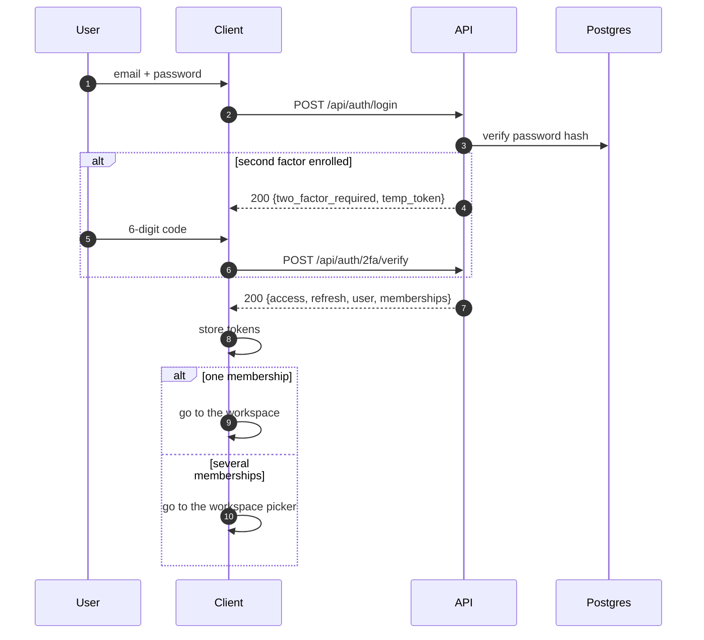

# Authentication and authorisation

> **Audience & scope.** Engineers implementing or reviewing access control. Covers tokens, login, the workspace hand-off, biometric unlock, the permission matrix and — the part unique to this product — the two extra gates that make "an agent sees only their assigned surveys" true. Role intent is in [`../product/PERSONAS_AND_ROLES.md`](../product/PERSONAS_AND_ROLES.md).

## Two questions, four mechanisms

| Question | Mechanism |
|---|---|
| Who are you? | **Authentication** — JWT, optionally with a second factor |
| May you perform this action on this module? | **Permission** — the role × module × action matrix |
| On which records? | **Row-level scoping** — applied in the queryset |
| Are you allowed near *this specific* survey or respondent? | **Contextual gates** — assignment, and consent |

All four are enforced on the server. The clients implement the first three for user experience — hiding a button the user cannot use — and that is all it is. Hiding a button does not make an endpoint safe, and the portal is written on the assumption that someone will call the API directly.

---

## Tokens

| Token | Lifetime | Storage | Rotation |
|---|---|---|---|
| Access | 15 minutes | Web: browser local storage. Mobile: the platform secure store. | Reissued from the refresh token |
| Refresh | 7 days | Same | Rotated on every use; the previous one is blacklisted |

Both carry `user_id`, `tenant_schema` when the session is tenant-scoped, `is_superadmin`, and a unique token id. Lifetimes are environment-configurable.

**Why the tenant is a claim and not only a hostname:** the mobile app points at one API host for its whole life. Without the claim, an installed app could not serve agents from different customers. See [`MULTI_TENANCY.md`](./MULTI_TENANCY.md).

### Three rules about refresh, each preventing a specific failure

1. **Proactive refresh.** The client refreshes when the access token is within 30 seconds of expiry, *before* sending. A page opening six parallel requests at the moment of expiry otherwise gets six simultaneous 401s and six refresh attempts.
2. **Single-flight reactive refresh.** On a 401, one refresh is attempted and the original request is retried once. Concurrent 401s share one in-flight refresh promise. Login, refresh and logout are excluded from the retry path — retrying logout against a 401 produces an infinite sign-out loop.
3. **Offline-aware clearing.** Credentials are cleared **only** on a real 401 or 403 *with a response body*. A network error, a timeout, a 502 or a CORS failure rethrows and keeps the session. An agent whose cellular connection drops mid-request must not be signed out and lose access to their queued work.

Rule 3 is the one that gets written wrong most often, and its failure mode — a field team signed out in a village with no way back in — is expensive.

---

## Login



Protections on this endpoint: rate limiting per account and per source address; failed attempts logged with a **hashed fingerprint of the email** rather than the address itself, so failures stay correlatable without turning the log into a list of registered users; the last sign-in address recorded on success.

On a tenant subdomain, a non-superadmin with no active membership for that tenant is rejected with a distinct code (`tenant_mismatch`) rather than "wrong password" — the credentials were right, the workspace was wrong, and saying so avoids a support call.

## The workspace hand-off

A user with several memberships picks one. The move from the shared login host to a tenant subdomain crosses an origin boundary, and browser-local tokens do not cross origins.

```mermaid
sequenceDiagram
    autonumber
    participant C as Browser on the login host
    participant API as API
    participant T as Browser on abc.surveyqs.com

    C->>API: POST /api/auth/workspace-switch {schema}
    API->>API: mint a single-use token, 15-minute TTL, tenant-scoped
    API-->>C: {redirect: https://abc.surveyqs.com/auth/activate?token=…}
    C->>T: full navigation
    T->>API: POST /api/auth/bridge/activate {token}
    API->>API: lock and consume the token; re-check membership now
    API-->>T: {access, refresh} scoped to the tenant
    T->>T: full page load into the workspace
```

Three details:

- The one-time token **is** the credential, so the activate endpoint is anonymous, rate-limited, and consumes the token under a row lock so a double-click cannot use it twice.
- Membership is **re-checked at activation**, not only at issue. It can have been revoked in the intervening seconds.
- The final step is a full page load, not a client-side route change, so no cached data from the previous workspace can survive into the new one.

## Mobile session handling

**Biometric unlock unlocks an existing session; it never replaces the first sign-in.** The first login is always email and password. Afterwards, the refresh token stays in the secure store and biometrics gate access to it.

Two sign-out modes, and the distinction is deliberate:

| Mode | When | What it clears |
|---|---|---|
| **Soft** | The user signs out with biometrics enabled | Cached data and the access token. The refresh token and the remembered email survive, so biometric sign-in still works. |
| **Full** | Biometrics off, or "sign in as a different user" | Everything: both tokens, the cache, the remembered identity, biometric enrolment, and the push registration. |

A soft sign-out is what the user means by "lock my phone". A full sign-out is what they mean by "this is someone else's phone now" — and the second case matters, because the outbox may hold the previous user's unsent work. That queue is quarantined rather than transmitted; see [`OFFLINE_SYNC.md`](./OFFLINE_SYNC.md).

A background re-lock timer requires an unlock after a configurable idle period.

---

## The permission matrix

Five tables in the tenant schema. None carries a tenant column — they are already inside the tenant's schema.

| Table | Holds |
|---|---|
| `Module` | The feature catalogue: `surveys`, `assignments`, `responses`, `respondents`, `reports`, `users`, `settings`, `audit` |
| `TenantModule` | Whether this tenant has the module switched on |
| `Role` | `admin`, `supervisor`, `agent`, `analyst`, plus any custom roles |
| `RolePermission` | One row per `(role, module, action)` with a granted flag |
| `UserRole` | Links a user to a role in this tenant |

Actions: `view`, `create`, `edit`, `delete`, `approve`, `export`.

### The check, in order

```
def user_has_permission(user, module_code, action):
    if user.is_superadmin:                      return True
    if not tenant_module_enabled(module_code):  return False   # ← before any role lookup
    if user_has_role("admin"):                  return True
    return RolePermission.objects.filter(
        role__in=user_roles, module__code=module_code,
        action=action, is_granted=True).exists()
```

The order is the specification. A module disabled by the superadmin is unreachable **even for the tenant's own administrator** — that is what makes it a commercial control rather than a suggestion.

### Declaring it on a view

```python
class ResponseViewSet(TenantScopedMixin, ModelViewSet):
    permission_classes = [IsAuthenticated, HasPermission]
    module_code = "responses"
    REQUIRED_ACTIONS = {
        "GET": "view", "HEAD": "view", "OPTIONS": "view",
        "POST": "create", "PUT": "edit", "PATCH": "edit", "DELETE": "delete",
    }
```

The permission class **fails closed**: a view that declares neither `module_code` nor a required action is denied, not allowed. A forgotten declaration becomes a loud 403 in development rather than a silent hole in production.

---

## Row-level scoping

Permissions say *may*. Scoping says *which*. Scoping lives in `get_queryset`, so the database returns fewer rows — never in the serializer and never in the client.

```python
def scope_responses(qs, user):
    if user_has_role(user, "admin") or user_has_role(user, "analyst"):
        return qs
    if user_has_role(user, "supervisor"):
        return qs.filter(collected_by__in=agents_reporting_to(user))
    return qs.filter(collected_by=user)          # agent: their own, and only their own
```

A scoping function exists per module in `scoping.py`, and every list view calls one. The last line is the rule your brief depends on, and it is one line precisely so it is hard to get wrong.

**A record outside your scope returns 404, not 403.** Confirming that a response exists but belongs to someone else is an information leak, small but unnecessary.

Optional **area scoping** layers on top for tenants that use it: an agent restricted to certain villages sees only respondents in those villages. It narrows; it never widens. An agent restricted to Jainad still sees only their own responses within Jainad.

---

## The two contextual gates

This is where SurveyQs differs from a generic admin application. Some checks are not about a role or a row set — they are about a relationship between this user and this particular object.

Both are implemented as **composable permission classes** layered on top of the role check, not as extra clauses inside it. A view opts in by declaring a resolver; a view that does not opt in is unaffected.

### The assignment gate

> An agent may work with a survey only while an active assignment links them to it.

Applies to: downloading a form package, creating a response, submitting one.

```python
class AssignmentGate(BasePermission):
    """RBAC says the role may collect responses.
       This says: only for a survey actually assigned to them."""
    def has_permission(self, request, view):
        if is_read_only(request):              return True    # reads are scoped, not gated
        if not user_has_role(request.user, "agent"): return True
        survey_id = view.resolve_survey_id(request)
        if survey_id is None:                  return True    # nothing to gate on
        return SurveyAssignment.objects.filter(
            survey_id=survey_id, assignee=request.user, status="active").exists()
```

Three deliberate properties:

- **Reads are not gated.** Visibility of responses is scoping's job; adding a second mechanism to the same question produces confusing failures.
- **No resolvable subject means allowed through.** The gate narrows a known case; it does not become a blanket denial on endpoints it does not understand.
- **Failure has its own error code** — `no_active_assignment`, not a generic permission denial — so the mobile app can explain what happened.

The offline wrinkle: a submission can arrive days after collection. The server compares the response's `started_at` against the assignment's `revoked_at`. Work done while the assignment was live is accepted; work started after revocation is refused. See [`../product/ASSIGNMENT_AND_TARGETS.md`](../product/ASSIGNMENT_AND_TARGETS.md).

### The consent gate

> Where a survey requires consent, no personal data about a respondent may be written without a consent record.

Same shape. Reads pass; writes to a consent-requiring survey check for a valid, unwithdrawn consent record for that respondent and notice. Failure returns `consent_missing`.

---

## Superadmin boundaries

The superadmin is a platform operator, not a universal key.

| May | May not |
|---|---|
| Create, deactivate, delete tenants | Read respondents, responses or answers |
| Provision the first administrator | Create or edit a survey |
| Enable or disable modules per tenant | Assign work |
| See counts, health and platform audit | Export tenant data |

A superadmin token carries no `tenant_schema` claim, so it resolves to the public schema where tenant endpoints do not exist. The isolation is structural, not a series of `if` statements sprinkled through tenant views.

Support access to a tenant's data exists — sometimes it genuinely must — but it is an explicit, time-bounded, audited elevation performed by a tenant administrator granting a support account a membership, and it is visible in that tenant's audit log. It is never silent and never implicit in the superadmin role.

---

## Audit

Every create, update, delete and approve on a significant record writes an audit row: actor, timestamp, action, entity type and id, before and after values, changed field list, source address, user agent and request id.

Three properties worth stating:

- **Append-only.** The application has no code path that updates or deletes an audit row.
- **The actor is soft-linked.** The row stores the user id and the email as a value, with no foreign key, so deleting a user cannot break the trail.
- **Driven by a declared set of models.** Adding a model to auditing is one entry in a list, which is what keeps coverage complete as the product grows.

Additionally audited, because they are the questions customers ask: every export (who, which filters, how many rows), every access to unmasked personal data by a non-admin role, and every consent withdrawal or erasure.

---

## Threat notes

| Threat | Control |
|---|---|
| Credential stuffing | Rate limiting per account and per address; strong password hashing; optional second factor |
| Token theft from a lost phone | Short access lifetime; secure-store storage; biometric re-lock; remote session revocation |
| A malicious agent reading another agent's data | Row-level scoping in the queryset; 404 rather than 403 |
| A malicious agent submitting to an unassigned survey | The assignment gate, re-checked server-side on every submission |
| A tenant user reaching another tenant | Schema isolation; the claim is validated against a real membership |
| Privilege escalation by editing a client bundle | Every check is server-side; the client's copy is presentation only |
| A forgotten permission declaration on a new view | The permission class fails closed |
| Enumerating registered email addresses | Login failures logged by hashed fingerprint; password reset responds identically whether or not the address exists |

---

*Last reviewed: 2026-09-11. Source of truth: the permission classes, the scoping functions, and the token settings.*
