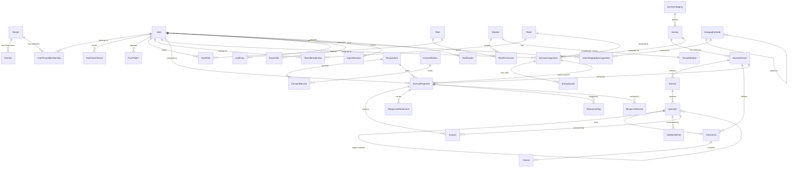

# Data model

> **Audience & scope.** Backend engineers and reviewers. The conceptual entity map plus a table-by-table reference with the keys, constraints and indexes that matter. Answer storage reasoning is in [`ANSWER_STORAGE.md`](./ANSWER_STORAGE.md); the JSON form of a survey is in [`FORM_SCHEMA.md`](./FORM_SCHEMA.md).

## Conventions applied everywhere

| Convention | Reason |
|---|---|
| **UUID primary keys** | No enumerable integers in URLs; safe to generate on a device before the server has seen the record |
| **`created_at` / `updated_at`** on every table | Free debugging |
| **`created_by` / `updated_by`** on user-authored records | Audit without reconstructing from the log |
| **Soft delete** (`is_deleted`) on user-visible records | An accidental deletion of collected fieldwork is recoverable |
| **Cross-schema foreign keys declared without a database constraint** | Postgres cannot enforce across schemas; integrity is logical and tested |
| **No `tenant_id` column on tenant tables** | The schema is the tenant. Nothing to filter, nothing to forget. |
| **Human-readable codes alongside UUIDs** where people quote them | `RESP-2026-004821` on a response, generated by a row-locked sequence |

---

## Entity map

The diagram is conceptual — it shows entities that matter to the domain, not every junction table.

---

## Public schema

### `Tenant`
One customer workspace.

| Column | Type | Notes |
|---|---|---|
| `id` | uuid PK | |
| `name` | text | "ABC Company" |
| `subdomain` | text unique | `^[a-z][a-z0-9-]{1,38}[a-z0-9]$`, reserved names refused |
| `schema_name` | text unique | Derived: `tenant_<subdomain>` with hyphens converted |
| `plan` | enum | `trial` / `basic` / `enterprise` |
| `is_active` | bool | Deactivated tenants refuse logins |
| `is_ready` | bool | False until provisioning completes |
| `provisioning_error` | text null | Retained for diagnosis |
| `settings` | jsonb | Date format, time zone, branding, defaults |

Schema creation and dropping are **not** automatic on save — provisioning is an explicit, staged service (see [`MULTI_TENANCY.md`](./MULTI_TENANCY.md)).

### `Domain`
Hostname → tenant. Partial unique index ensuring **one primary domain per tenant**.

### `User`
| Column | Notes |
|---|---|
| `id` uuid PK | |
| `email` unique | The username. No separate username field. |
| `password` | Argon2 |
| `full_name`, `phone` | |
| `is_superadmin`, `is_active`, `is_staff` | |
| `preferred_tenant` FK null | A convenience default only — never an authorisation source |
| `reporting_manager` self-FK null | An agent's supervisor |
| `otp_secret` (encrypted), `is_2fa_enabled` | |
| `last_login_at`, `last_login_ip` | |

### `UserTenantMembership`
`(user, tenant)` unique. Carries `role_code` mirroring the tenant-schema role, `is_active`, `joined_at`, `invited_by`.

It answers *is this user a member?*. Actual permissions always come from `UserRole` inside the tenant schema. Keeping the mirror is what lets the workspace picker render without opening every tenant's schema.

### `TwoFactorDevice`, `RecoveryCode`, `PushToken`, `OneTimeToken`, `PlatformAuditLog`
Supporting tables: encrypted TOTP secrets; hashed single-use recovery codes; per-device push registrations deactivated when the relay reports them stale; short-lived single-use workspace hand-off tokens; and the platform-level audit stream.

---

## Tenant schema — access control

### `Module`, `TenantModule`, `Role`, `RolePermission`, `UserRole`
As described in [`AUTH_AND_RBAC.md`](./AUTH_AND_RBAC.md). `RolePermission` is unique on `(role, module, action)`; `UserRole` on `(user, role)`.

### `Team`, `TeamMembership`
A supervisor and their agents. `TeamMembership` unique on `(team, user)`. Used by team-level assignment and by supervisor scoping.

### `GeographyNode`, `UserGeographyAssignment`
A self-referential hierarchy — country → state → district → sub-district → village — with a materialised path for fast subtree queries, and per-user area coverage.

---

## Tenant schema — survey definition

### `SurveyCategory`
| Column | Notes |
|---|---|
| `id`, `code`, `label`, `description`, `icon`, `color` | `code` unique within the tenant |
| `display_order`, `is_active` | |

The "topic" — Farming, Electronics, Automotive.

### `Survey`
| Column | Notes |
|---|---|
| `id` uuid PK | |
| `category` FK | Required |
| `title`, `description`, `instructions` | |
| `status` | `draft` / `published` / `paused` / `closed` / `archived` |
| `current_version` FK null | The live published version |
| `draft_version` FK null | The working copy, when editing a published survey |
| `settings` jsonb | Anonymity, consent, GPS requirement, one-per-respondent, auto-approve, grace days |
| `created_by`, `created_at`, `updated_at` | |

Deleting a survey with responses is refused at the service layer, not only by a database constraint, so the error message can explain why.

### `SurveyVersion`
| Column | Notes |
|---|---|
| `id` uuid PK | |
| `survey` FK | |
| `version_number` int | Unique with `survey` |
| `status` | `draft` / `published` |
| `schema_json` jsonb | **The frozen form package.** Complete and self-sufficient. |
| `schema_hash` | For cheap change detection on the device |
| `published_at`, `published_by`, `change_note` | |
| `response_count` | Denormalised counter, maintained by the submit service |

`schema_json` duplicates the relational rows below. That is intentional: the relational rows are what the builder edits, and the JSON is what ships and what a response is interpreted against forever. Only the JSON is guaranteed immutable.

### `Section`
`(version, code)` unique. Holds `order`, `title`, `description`, `relevant`.

### `Question`
| Column | Notes |
|---|---|
| `id` uuid PK | |
| `section` FK | |
| `parent_question` FK null | Set for questions inside a repeat group |
| `code` | `^[a-z][a-z0-9_]{0,62}$`, unique within the version |
| `type` | See the type catalogue |
| `order` | |
| `label_i18n`, `hint_i18n` | jsonb keyed by language |
| `is_required` | bool or an expression string |
| `relevant`, `constraint`, `constraint_message_i18n` | |
| `default_value`, `calculation` | |
| `read_only`, `is_pii` | |
| `choice_list` FK null | |
| `config` jsonb | Type-specific |

Indexes: `(section, order)`, `(version, code)` — the second via the section join, materialised because the exporter and validator both look questions up by code.

### `ChoiceList`, `Choice`
`ChoiceList` is `(version, name)` unique with an `attributes` list for cascading filters. `Choice` is `(list, value)` unique, carrying `label_i18n`, `order`, `attrs` jsonb and `is_active`.

Choices belong to the **version**, not the survey, so a published version's option set is frozen with everything else.

### `ValidationRule`
Optional row-level validation where a single expression is not enough — several independent rules on one question, each with its own message. Most validation compiles into `Question.constraint`; this table exists for the cases that do not.

---

## Tenant schema — assignment

### `SurveyAssignment`
| Column | Notes |
|---|---|
| `id` uuid PK | |
| `survey` FK | Must be published |
| `assignee_type` | `user` / `team` / `area` |
| `assignee_user` / `assignee_team` / `assignee_area` FK null | Exactly one populated, enforced by a check constraint |
| `target_count`, `due_date`, `priority`, `instructions` | |
| `status` | `active` / `revoked` |
| `assigned_by`, `assigned_at`, `revoked_by`, `revoked_at` | |

Partial unique index on `(survey, assignee_user)` where `status = 'active'` — one live assignment per agent per survey. Reassignment revokes and recreates rather than editing in place, preserving the history.

### `SurveyQuota`
`(assignment, dimension_question_code, cell_value)` with `target_count`, `achieved_count` and `is_enforced`. `achieved_count` is maintained by the submit service inside the same transaction as the response.

---

## Tenant schema — respondents

### `Respondent`
| Column | Notes |
|---|---|
| `id` uuid PK | |
| `full_name`, `phone`, `alt_phone`, `email` | PII |
| `gender`, `date_of_birth`, `age_band` | |
| `identity_number` | PII, tenant-labelled |
| `address`, `geography_node` FK | |
| `custom_fields` jsonb | Tenant-configured extras |
| `consent_status` | `none` / `granted` / `withdrawn` |
| `is_anonymised`, `anonymised_at` | |
| `client_ref_id` uuid null | The device-generated id, for offline idempotency |
| `created_by`, `created_at` | |

Indexes and constraints:

- Partial unique on `phone` where not null and not deleted.
- Partial unique on `identity_number` where not null and not deleted.
- **Partial unique on `client_ref_id` where not null** — so a device retry updates rather than duplicates, while web and import paths, which send no such id, are unconstrained.
- A trigram index on `full_name` for fuzzy duplicate detection.

### `ConsentNotice`, `ConsentRecord`
`ConsentNotice` holds versioned notice text per language with an active flag. `ConsentRecord` holds respondent, notice version, language, granted timestamp, method, signature or document attachment, capturing user, an offline flag, agreed purposes, and an integrity hash over the record's fields.

Withdrawal is a separate row, not an update — the history of consenting and then withdrawing is itself the evidence.

---

## Tenant schema — responses

### `SurveyResponse`
| Column | Notes |
|---|---|
| `id` uuid PK | |
| `response_code` | `RESP-2026-004821`, from a row-locked sequence |
| `survey` FK, `survey_version` FK | **The version pin. Never updated.** |
| `assignment` FK null | |
| `respondent` FK null | Null for anonymous surveys |
| `collected_by` FK → public user | Cross-schema, no DB constraint |
| `status` | `submitted` / `under_review` / `approved` / `rejected` |
| `answers` jsonb | The denormalised document, GIN-indexed |
| `started_at`, `submitted_at`, `duration_seconds` | |
| `gps_lat`, `gps_lng`, `gps_accuracy_m`, `gps_captured_at` | |
| `device_id`, `app_version`, `os_version`, `was_offline` | |
| `client_ref_id` uuid | **The idempotency key** |
| `quota_cell` text null | |
| `is_edited`, `edited_at`, `edited_by` | |
| `is_deleted`, `deleted_at`, `deleted_by` | |

Constraints and indexes:

- **Partial unique on `client_ref_id` where not null** — the whole basis of safe retries.
- Partial unique on `(survey, respondent)` where the survey is configured one-per-respondent and the row is not deleted.
- `(survey, status, submitted_at)`, `(collected_by, submitted_at)`, `(assignment)`, GIN on `answers`.

### `Answer`
As specified in [`ANSWER_STORAGE.md`](./ANSWER_STORAGE.md): response, question, `question_code` snapshot, `value_type`, the six typed value columns with a check constraint that exactly one is populated, and `repeat_path` / `repeat_index`.

Unique on `(response, question, repeat_path, repeat_index)`.

### `ResponseAttachment`
Response, question code, kind, filename, content type, size, checksum, storage key, capture timestamp, capture GPS, upload status, and `client_ref_id` for idempotent upload retries. Storage keys are tenant-namespaced.

### `ResponseFlag`
Response, rule code, severity, message, the values that triggered it, raised timestamp, and resolution fields. One response can carry several flags.

### `ResponseReview`
An append-only review history: response, reviewer, action (`approve` / `reject` / `reopen`), reason code, notes, timestamp. A response rejected twice has two rows, which is what makes "this agent resubmits after rejection" measurable.

---

## Tenant schema — platform services

### `AuditLog`
Actor id and email (soft-linked), action, entity type and id, entity label, before and after values, changed field list, source address, user agent, request id, timestamp, and a denormalised tenant id. Indexed on `(entity_type, entity_id)`, `(user_id, created_at)`, `(action, created_at)`.

### `ExportJob`
Requester, export type, filters snapshot, format, status, row count, file key, expiry, error. Filters are snapshotted so a completed export can state exactly what it contains.

### `ImportSession`, `ImportJob`, `ImportFieldMapping`
The multi-step wizard's server-side state: uploaded file, detected headers, current step, column mapping, preview results, and the resulting job with per-row errors. Server-side state is what lets an import survive a page refresh or a lost connection.

### `Notification`, `NotificationPreference`
Per-user in-app notifications with type, payload, read state; and per-user channel preferences with muted categories.

### `DeviceSession`
One row per device installation: device id, user, platform, app version, last sync timestamp, last known outbox depth. Populated from sync request headers, and the basis of the "Agent B has not synced in five days" warning.

### `NumberSequence`
Row-locked counters producing `response_code` and similar human-facing identifiers, with a prefix template and an annual reset.

---

## Volume expectations

For a large tenant: 200 surveys, 500 versions, 100,000 responses, 3,000,000 answers, 150,000 attachments, 60,000 respondents, 500,000 audit rows.

All well within a single Postgres instance. The largest table, `Answer`, is per-tenant by construction, so no cross-tenant contention exists. Partitioning `Answer` by `survey_id` is the first lever if one tenant exceeds roughly ten million rows, and the schema is shaped so that is a partitioning change rather than a redesign.

---

## The constraints to test first

If only four things are asserted, assert these:

1. `client_ref_id` is partially unique on `SurveyResponse` and `Respondent` — **the single most important constraint in the system**, and the one that makes offline retries safe.
2. `Answer` allows exactly one populated value column.
3. `(survey, respondent)` is unique when the survey is configured one-per-respondent.
4. A tenant's rows are unreachable from another tenant's session.

---

*Last reviewed: 2026-09-11. Source of truth: the Django models. This document is the conceptual view; it is not a column-by-column dump.*
