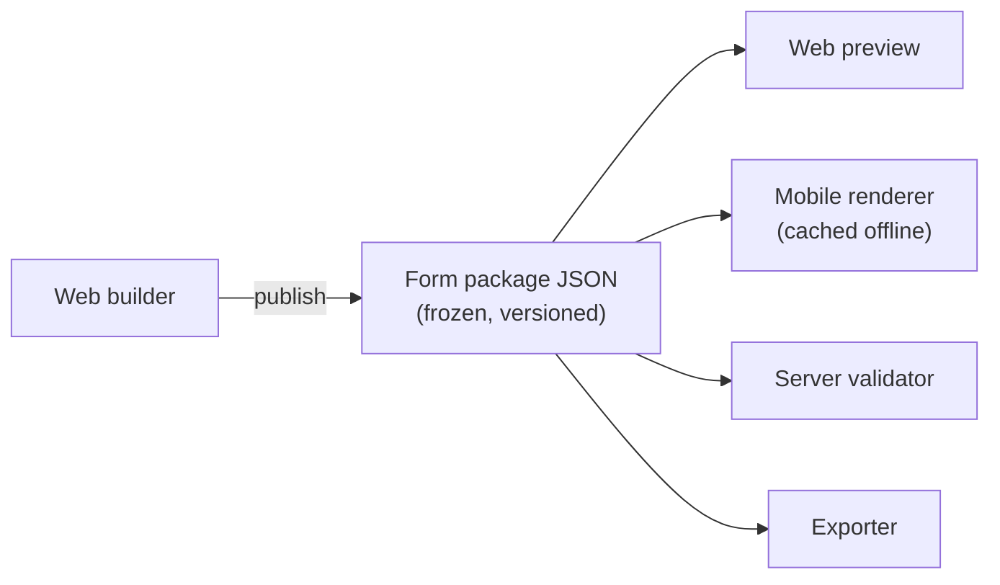

# Form schema specification

> **Audience & scope.** Engineers implementing the builder, the renderers, the validator and the exporter. This is the contract between all four. Product meaning of each field is in [`../product/QUESTION_TYPES.md`](../product/QUESTION_TYPES.md) and [`../product/FORM_LOGIC.md`](../product/FORM_LOGIC.md); storage in [`DATA_MODEL.md`](./DATA_MODEL.md).

## What this document defines

One JSON document, the **form package**, that fully describes a survey version. It is produced by the builder at publish time, frozen, shipped to devices, and used to render, validate and export. Nothing else needs to be consulted to interpret a response.



Design rules, in priority order:

1. **Self-contained.** A package can be interpreted years later with no other lookup.
2. **Immutable once published.** Every field is frozen. Corrections are a new version.
3. **Ordered.** Arrays carry meaning; `sections[2]` comes after `sections[1]`. The renderer never sorts.
4. **Additive evolution.** New optional keys may be added; existing keys never change meaning. An old reader must skip unknown keys rather than fail.
5. **Small enough for a phone.** Under 1 MB for a typical survey. Large choice lists are the only realistic risk and the builder warns about them.

---

## Top-level structure

```json
{
  "schema_version": "1.0",
  "survey_id": "8f2a1c34-...",
  "version_id": "b71d9e02-...",
  "version_number": 2,
  "published_at": "2026-09-04T11:22:03Z",
  "published_by": "user-uuid",
  "change_note": "Changed q7 from acres to hectares",

  "title": "Farming Survey",
  "description": "Annual practices and yield survey",
  "category": { "id": "cat-uuid", "code": "farming", "label": "Farming" },
  "instructions": "Introduce yourself, then read the consent notice aloud.",

  "settings": { ... },
  "languages": { "default": "en", "available": ["en", "mr", "hi"] },
  "choice_lists": [ ... ],
  "sections": [ ... ],
  "metadata_questions": [ ... ]
}
```

`schema_version` is the version of *this specification*, not of the survey. It exists so a device running an older app can recognise a package it cannot fully render and say so, rather than rendering it wrongly.

### `settings`

```json
{
  "anonymous": false,
  "consent_required": true,
  "consent_notice_id": "notice-uuid",
  "consent_methods": ["verbal_confirmed", "signature"],
  "one_response_per_respondent": false,
  "require_gps": true,
  "gps_accuracy_threshold_m": 50,
  "allow_draft": true,
  "auto_approve": false,
  "show_progress": true,
  "allow_back_navigation": true,
  "randomize_sections": false,
  "estimated_minutes": 22,
  "close_grace_days": 14
}
```

---

## Choice lists

Defined once at the package level and referenced by questions, so a 5,000-row district list is not duplicated fourteen times.

```json
"choice_lists": [
  {
    "name": "yes_no",
    "choices": [
      { "value": "yes", "label": { "en": "Yes", "mr": "होय" }, "order": 1 },
      { "value": "no",  "label": { "en": "No",  "mr": "नाही" }, "order": 2 }
    ]
  },
  {
    "name": "districts",
    "attributes": ["state"],
    "choices": [
      { "value": "d_pune",   "label": { "en": "Pune" },   "order": 1, "attrs": { "state": "s_mh" } },
      { "value": "d_nashik", "label": { "en": "Nashik" }, "order": 2, "attrs": { "state": "s_mh" } },
      { "value": "d_surat",  "label": { "en": "Surat" },  "order": 3, "attrs": { "state": "s_gj" } }
    ]
  }
]
```

- `value` is what is stored and exported. Immutable within a version; **stable across versions by convention**, and the builder warns loudly when a value changes because it breaks cross-version aggregation.
- `label` is always an object keyed by language, even in a single-language survey. Making it a plain string in v1 and an object in v2 is a migration nobody enjoys.
- `attrs` carries the columns a `choice_filter` can match on, for cascading selects.
- A choice may carry `"active": false`. Inactive choices are not offered for new answers but **are still rendered** when a stored answer references them, labelled as inactive.

---

## Sections

```json
"sections": [
  {
    "id": "sec-1",
    "code": "screening",
    "order": 1,
    "title": { "en": "Screening" },
    "description": { "en": "Confirm eligibility before continuing." },
    "relevant": null,
    "questions": [ ... ]
  }
]
```

A section is a screen on mobile and a page in the web preview. `relevant` is an expression string or `null`. `code` is stable and appears in exports as a column-group prefix where the exporter needs one.

---

## Questions

The universal fields, present on every question of every type:

```json
{
  "id": "q-uuid",
  "code": "owns_vehicle",
  "order": 3,
  "type": "yes_no",

  "label":   { "en": "Do you own a vehicle?", "mr": "..." },
  "hint":    { "en": "Include vehicles owned by the household." },

  "required": true,
  "required_message": { "en": "Please record an answer before continuing." },

  "relevant": null,
  "constraint": null,
  "constraint_message": null,

  "default": null,
  "calculation": null,
  "read_only": false,
  "is_pii": false,

  "config": { }
}
```

| Field | Type | Notes |
|---|---|---|
| `id` | uuid | Stable identity of the question within the version |
| `code` | string | `^[a-z][a-z0-9_]{0,62}$`. Unique within the version. The export column name and the logic reference. |
| `type` | enum | One of the types in [`../product/QUESTION_TYPES.md`](../product/QUESTION_TYPES.md) |
| `required` | bool **or** expression string | An expression makes it conditionally required |
| `relevant` | expression string or null | Skip logic |
| `constraint` | expression string or null | `.` is the entered value |
| `constraint_message` | label object | **Mandatory whenever `constraint` is set** |
| `default` | literal or expression | Evaluated once at response creation |
| `calculation` | expression string | Only on `type: "calculate"` |
| `is_pii` | bool | Drives masking and erasure |
| `config` | object | Type-specific; see below |

Two invariants the publisher enforces and every reader may assume:

- Every `${code}` inside `relevant`, `constraint`, `default` and `calculation` resolves to a question that exists in this package.
- Every reference in `relevant` points at a question appearing **earlier** in document order.

---

## `config` by type

Only the distinctive keys are shown; the full set is in the type catalogue.

```json
// text
"config": { "max_length": 200, "input_mode": "text", "mask": false, "transform": "trim" }

// integer
"config": { "min": 0, "max": 120, "appearance": "default", "thousands_separator": false }

// decimal
"config": { "min": 0, "max": 9999.99, "decimal_places": 2, "unit_label": "acres" }

// select_one
"config": {
  "choice_list": "crops",
  "appearance": "auto",          // auto | radio | dropdown | searchable | quick | likert | columns:2
  "randomize": false,
  "randomize_seed": null,
  "allow_other": true,
  "other_label": { "en": "Other (specify)" },
  "choice_filter": null          // e.g. "state = ${state}"
}

// select_multiple
"config": {
  "choice_list": "crops",
  "min_selections": 1,
  "max_selections": 3,
  "exclusive_choices": ["none"]
}

// rating
"config": { "max": 5, "icon": "star", "low_label": {"en":"Poor"}, "high_label": {"en":"Excellent"}, "allow_half": false }

// nps
"config": { "follow_up": true, "follow_up_code": "nps_reason" }

// likert
"config": { "scale": "agreement", "points": 5, "include_neutral": true }

// matrix_single
"config": {
  "rows":    [ { "key": "price",   "label": {"en":"Price"} },
               { "key": "service", "label": {"en":"Service"} } ],
  "columns": { "choice_list": "satisfaction_5" },
  "randomize_rows": false,
  "required_rows": "all"         // "all" | "none" | ["price"]
}

// ranking
"config": { "choice_list": "priorities", "rank_top_n": 3, "randomize": true }

// date
"config": { "appearance": "calendar", "min_date": "1900-01-01", "max_date": "today()" }

// geopoint
"config": { "required_accuracy_m": 50, "timeout_s": 60, "allow_manual_map_pin": false, "show_map": true }

// image
"config": { "max_count": 3, "source": "camera_only", "max_pixels": 1600, "quality": 0.7, "annotate": false }

// barcode
"config": { "formats": ["qr","code128","ean13"], "allow_manual_entry": true, "validate_pattern": "^BAG[0-9]{6}$" }

// note  — renders label only, stores nothing
"config": { }

// hidden
"config": { "source": "assignment_id" }   // assignment_id | device_id | quota_cell | respondent.<field>
```

`"appearance": "auto"` is the default everywhere it applies and means *the renderer decides from cardinality* — six or fewer choices become chips, more become a searchable list. An explicit appearance overrides it.

---

## Repeat groups

A repeat is an entry in `questions` with `"type": "repeat"` and its own nested array, so document order is preserved without a parallel structure.

```json
{
  "id": "rep-uuid",
  "code": "children",
  "order": 5,
  "type": "repeat",
  "label": { "en": "Children in the household" },
  "relevant": "${has_children} = true",
  "config": {
    "count_mode": "from_answer",       // agent_controlled | fixed | from_answer
    "count_expression": "${number_of_children}",
    "fixed_count": null,
    "max_instances": 15,
    "summary_template": "Child ${repeat_index}: ${child_name}, ${child_age}"
  },
  "questions": [
    { "id": "...", "code": "child_name", "type": "text",    "required": true,  "order": 1, "config": {} },
    { "id": "...", "code": "child_age",  "type": "integer", "order": 2,
      "constraint": ". >= 0 and . <= 25",
      "constraint_message": { "en": "Age must be between 0 and 25." },
      "config": { "min": 0, "max": 25 } }
  ]
}
```

`summary_template` is what the mobile list renders per instance card, so a ten-child repeat is navigable rather than a wall of "Instance 4".

Inside a repeat, `${child_age}` resolves to the current instance and `${../household_income}` reaches outside. Nesting is permitted to two levels.

---

## Metadata questions

Values the system supplies, listed separately so they never appear in the visible question flow but do appear in exports.

```json
"metadata_questions": [
  { "code": "start_time",     "type": "datetime", "source": "response.started_at" },
  { "code": "end_time",       "type": "datetime", "source": "response.submitted_at" },
  { "code": "duration",       "type": "integer",  "source": "response.duration_seconds" },
  { "code": "device_id",      "type": "text",     "source": "device.id" },
  { "code": "app_version",    "type": "text",     "source": "device.app_version" },
  { "code": "assignment_id",  "type": "text",     "source": "response.assignment_id" }
]
```

---

## Answer document

The other half of the contract: what the device sends back. This is the shape the server validates and the exporter reads.

```json
{
  "client_ref_id": "9c1e7b44-...",
  "survey_id": "8f2a1c34-...",
  "survey_version_id": "b71d9e02-...",
  "assignment_id": "asg-uuid",
  "respondent": { "id": "resp-uuid" },

  "started_at":   "2026-09-10T09:14:02Z",
  "submitted_at": "2026-09-10T09:36:41Z",
  "duration_seconds": 1359,

  "gps": { "lat": 19.076090, "lng": 72.877426, "accuracy_m": 8.4,
           "captured_at": "2026-09-10T09:14:10Z" },
  "device": { "id": "dev-abc123", "app_version": "1.4.2", "os": "Android 13" },
  "was_offline": true,

  "answers": {
    "owns_vehicle":  true,
    "vehicle_count": 2,
    "crop":          "wheat",
    "crops_grown":   ["wheat", "rice"],
    "satisfaction":  { "price": "satisfied", "service": "neutral" },
    "priorities":    ["cost", "mileage", "comfort"],
    "plot_location": { "lat": 19.0761, "lng": 72.8774, "accuracy_m": 6.2,
                       "captured_at": "2026-09-10T09:20:11Z" },
    "plot_photo":    [ { "attachment_ref": "att-local-1", "filename": "plot.jpg" } ],
    "harvest_date":  "2026-08-14",
    "children": [
      { "repeat_index": 1, "child_name": "Asha", "child_age": 7 },
      { "repeat_index": 2, "child_name": "Ravi", "child_age": 4 }
    ]
  },

  "attachments": [
    { "ref": "att-local-1", "question_code": "plot_photo", "kind": "image",
      "filename": "plot.jpg", "size_bytes": 418233, "checksum": "sha256:...",
      "captured_at": "2026-09-10T09:20:30Z" }
  ]
}
```

### Value shape per type

| Type | JSON value |
|---|---|
| text, long_text, email, phone, url, barcode | string |
| integer, decimal, range, percentage, rating, nps, duration | number |
| yes_no, acknowledge | boolean |
| select_one, likert, semantic_differential | string — the choice `value` |
| select_multiple | array of strings, in selection order |
| ranking | array of strings, best first |
| constant_sum | object, item → number |
| matrix_single | object, row key → choice value |
| matrix_multiple | object, row key → array of choice values |
| date | `YYYY-MM-DD` |
| time | `HH:MM` |
| datetime | ISO 8601 with offset |
| geopoint | object with `lat`, `lng`, `accuracy_m`, `captured_at` |
| geotrace, geoshape | array of point objects |
| image, audio, video, file, signature | array of `{ attachment_ref, filename }` |
| currency | `{ "amount": 1200.50, "currency": "INR" }` |
| repeat | array of objects, each with `repeat_index` |
| calculate | the computed value, in its result type |
| note, section_break | absent — they store nothing |

Two rules:

- **Unanswered is absent, not null.** A key missing from `answers` means not answered. `null` is reserved for "explicitly cleared", which the server treats identically but which preserves the distinction in an audit trail.
- **`attachment_ref` is device-local.** The server replaces it with a real attachment id once the file lands. Answers referencing an attachment that never arrives are surfaced in Sync Review rather than dropped.

---

## Validation the server performs on submit

In order, stopping at the first failure that makes the rest meaningless:

1. **Package resolution** — `survey_version_id` exists, belongs to `survey_id`, and the survey accepts submissions (published, paused, or closed within the grace window).
2. **Assignment** — the submitting agent had an active assignment covering `started_at`.
3. **Idempotency** — if `client_ref_id` already exists for this tenant, this is a retry: update in place and return `200`, not `201`.
4. **Consent** — where `consent_required`, a consent record exists for this respondent and notice.
5. **Structure** — every key in `answers` corresponds to a question code in the pinned version. Unknown keys are recorded in `warnings` and dropped, never silently accepted.
6. **Relevance** — the server re-derives which questions were relevant from the submitted answers. Answers to irrelevant questions are dropped with a warning.
7. **Required** — every relevant required question has a value. A miss is a **rejection**.
8. **Type** — each value matches the shape table above. A mismatch is a rejection.
9. **Constraints** — every relevant constraint is re-evaluated. A failure is a rejection, naming the question code and the constraint message.
10. **Attachments** — every `attachment_ref` in `answers` appears in `attachments`.

Steps 5 and 6 produce **warnings**; steps 7 to 10 produce **rejections**. The distinction matters for the client: a warning still results in a stored response, a rejection does not. The error shape is in [`../api/SYNC_API.md`](../api/SYNC_API.md).

---

## Schema evolution

`schema_version` follows semantic versioning.

- **Patch** — clarification only, no reader change.
- **Minor** — new optional keys, new question types. An older reader must skip unknown question types and **refuse the package with a clear message** rather than render a partial form. Silently dropping a question is the one failure mode worse than refusing.
- **Major** — a breaking change. Devices must update before they can collect. The server keeps serving the old major to old clients for a deprecation window.

The device sends its supported `schema_version` when requesting a package. The server returns the newest compatible package, or an explicit `upgrade_required` — never a package the device cannot read.

---

*Last reviewed: 2026-09-11. Source of truth: this file. The builder's output and all three readers are tested against a shared fixture set of packages and answer documents held in the repository.*
