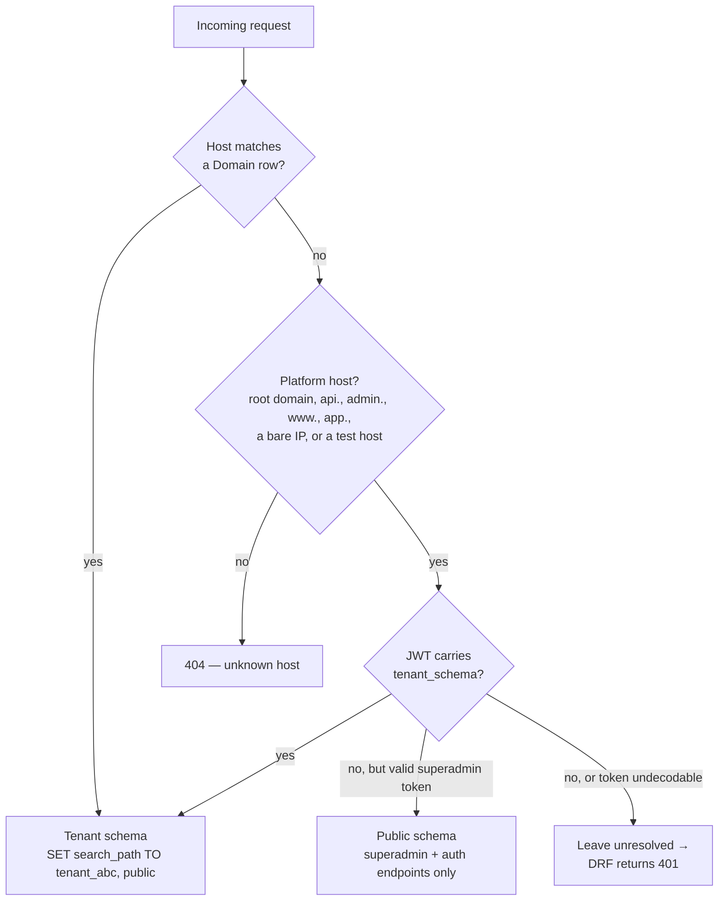
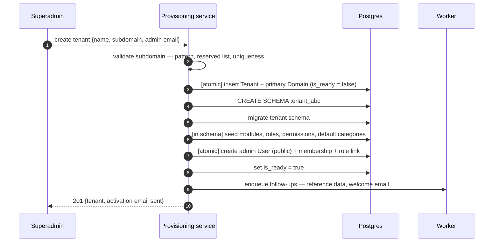
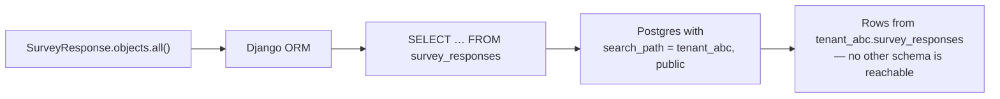

# Multi-tenancy

> **Audience & scope.** Engineers who need to understand how one customer's data is kept away from another's, how a request reaches the right schema, and how a tenant is created and destroyed. Superadmin workflows are in [`../guides/SUPERADMIN_GUIDE.md`](../guides/SUPERADMIN_GUIDE.md).

## TL;DR

SurveyQs uses **schema-per-tenant** isolation on PostgreSQL. Each tenant gets its own schema (`tenant_abc`, `tenant_xyz`). The schema is selected at request time from the hostname, or — for the mobile app, which talks to a single host — from a claim inside the JWT. Shared tables (tenants, domains, user accounts) live in `public`. Cross-tenant queries are not merely prevented by application code; they are physically impossible without explicitly switching schemas.

## Why schema-per-tenant

| Model | Advantage | Cost |
|---|---|---|
| Row-level (`tenant_id` column on every table) | Cheap; one set of tables; simple migrations | Every query must remember to filter. **One forgotten filter is a data breach.** |
| **Schema-per-tenant** | The database enforces the boundary. A new tenant is `CREATE SCHEMA`. | Migrations run per schema; some tooling assumes one schema. |
| Database-per-tenant | Strongest isolation; independent scaling | Heavyweight: connections, backups and migrations all multiply. |

The decision rests on one property: **a developer cannot leak another tenant's data by forgetting a `WHERE` clause.** In a product holding named individuals' personal data, collected under consent, that property is worth the migration complexity.

There is a second benefit that matters more here than in most products: because each tenant's `Answer` table is a separate physical table, one tenant with three million answer rows does not degrade query plans for a tenant with four thousand. See [`ANSWER_STORAGE.md`](./ANSWER_STORAGE.md).

## Public versus tenant schemas

| Schema | Holds | Apps |
|---|---|---|
| `public` | Tenants, domains, user accounts, memberships, two-factor secrets, push tokens, platform audit | `tenants`, `users`, `authentication`, `two_factor`, `auth_bridge`, `superadmin` |
| `tenant_<name>` | Everything tenant-scoped: roles, permissions, categories, surveys, versions, questions, assignments, respondents, consents, responses, answers, attachments, flags, imports, notifications, audit | `rbac`, `geography`, `surveys`, `assignments`, `respondents`, `responses`, `formlogic`, `reports`, `imports`, `notifications`, `audit` |

The split is declared once in settings as `SHARED_APPS` and `TENANT_APPS`. The rule for deciding: **if it must be readable before we know which tenant the request belongs to, it is public.** A user's email and password must be checkable before the tenant is known; a survey must not.

Some apps appear in both lists — `authentication` serves login on the public schema and workspace-scoped endpoints inside a tenant.

## Request routing

Every tenant has one or more `Domain` rows mapping a hostname to a tenant.

Three cases, all real:

1. **A tenant subdomain** — `abc.surveyqs.com`. The normal browser path.
2. **A platform host** — the root domain, `api.`, `admin.`, or a raw IP during development. Resolves to the public schema, where only superadmin and authentication endpoints exist.
3. **The single-host client.** The mobile app points at one API host forever. Its JWT carries `tenant_schema`, and the middleware switches schemas on that claim. This is what lets an app installed once serve an agent whose company lives on any subdomain.

### Two details that are not obvious

**When a host has already pinned the public URL configuration and a JWT claim then resolves a tenant, the pin must be explicitly cleared.** Otherwise the schema is correct but the URL routing still points at the public endpoint set, and every tenant route returns 404 while the database is sitting in the right schema. This produces a genuinely confusing class of bug and is worth a comment in the code.

**An undecodable token must leave the tenant unresolved so DRF returns 401, not 404.** The difference matters enormously to the mobile client: a 401 tells the sync engine "refresh the token and retry", while a 404 tells it "this endpoint does not exist, give up". Returning the wrong one silently kills an agent's queued work.

A genuinely unknown host — a typo — still returns 404. The fallback chain is not a blanket "when in doubt, use public".

## Provisioning a tenant

Creating a tenant is **deliberately not one atomic transaction**, because `CREATE SCHEMA` and the migrations that follow commit as they go and cannot be rolled back by wrapping them.

Failure handling is explicit at every step: the error is written to `provisioning_error` on the tenant, `is_ready` stays false, **and the partial schema is left in place for diagnosis**. Dropping it on failure destroys the only evidence of what went wrong.

A tenant that is not ready cannot be logged into, and appears in the superadmin list with its error visible.

### Seeding must be bulk

The default permission matrix is roughly a hundred and fifty rows. Seeding it with one `get_or_create` per row is a hundred and fifty round trips inside a web request, which is enough on its own to exceed a frontend timeout and make provisioning appear to fail while it is in fact still running. Seeds are bulk inserts with conflicts ignored, which also makes them idempotent and safe to re-run.

The same rule applies to anything that runs on the deploy path.

## Deprovisioning

| Action | Effect | Reversible |
|---|---|---|
| **Deactivate** | Logins refused with a clear message. No data touched. | Yes |
| **Reactivate** | Access restored unchanged. | — |
| **Delete** | `DROP SCHEMA ... CASCADE`, then public rows removed in dependency order: token blacklists → memberships → users with no other membership → domains → tenant. | **No** |

Deletion requires typing the subdomain to confirm and is recorded in the platform audit log.

The ordering of the public-row deletes is not incidental. The ORM's cascade would try to follow relations into the schema that was just dropped; the deletes are issued explicitly, in order, for that reason.

Deactivation and reactivation are performed while explicitly positioned in the public schema — updating a tenant row from inside a sibling tenant's schema is refused by the tenancy layer.

## How a query stays inside its tenant

There is no `tenant_id` on `SurveyResponse`. There is nothing to filter and nothing to forget. The connection's `search_path` decides which physical table the unqualified name resolves to.

The corresponding discipline is that **anything running outside a request must set its schema explicitly**. Every Celery task takes the schema name as its first argument and opens a schema context before touching the ORM. A task that forgets this operates on `public`, where the tenant tables do not exist, and fails loudly — which is the correct outcome, but the argument convention is what makes it hard to get wrong in the first place.

## Cross-schema references

A few relationships necessarily cross the boundary: `UserRole.user`, `SurveyResponse.collected_by`, `Notification.user` all point at `public.users`.

Postgres cannot enforce a foreign key across schemas, so these are declared without a database constraint and documented inline at every site. The integrity is logical and covered by tests. The alternative — duplicating user rows into each tenant schema — creates a synchronisation problem far worse than the one it solves.

`AuditLog` additionally carries a denormalised tenant identifier, so a platform-level audit stream can be assembled without re-joining across schemas.

## Migrations

Two commands, in this order, on every deploy:

1. Migrate the **shared** apps — the public schema.
2. Migrate **every ready tenant** schema.

The second is not the stock "migrate all tenants" command. It iterates tenants, checks the schema actually exists, and **skips with a warning** where it does not. A single half-provisioned tenant from a failed creation three weeks ago must not fail the entire release for everybody else.

Consequences to keep in mind:

- A migration touching a tenant app runs N times. Keep them fast and avoid full-table rewrites on large tables.
- Adding a column to `Answer` is the expensive case at scale. Prefer nullable additions and backfill in a background job.
- Index creation on a large tenant table should be concurrent, which means a migration that cannot run inside a transaction — flag it explicitly.

## Testing isolation

There is exactly one test that must never be allowed to fail, and it is the reason for the whole design:

> Create two tenants with identical-looking data. Authenticate as a user of tenant A. Assert that every list endpoint returns only A's rows, and that fetching a known id belonging to B returns 404 — **not** 403, which would confirm the record exists.

The test fixtures create two tenants by default so this assertion is cheap to write for any new module, and the test runs in CI on every change. It is the single highest-value test in the suite.

## Development note

Local development uses subdomains of `localhost` — `abc.localhost:3000` for the web portal, calling `abc.localhost:8000` for the API. The web client mirrors the browser's hostname when building the API base URL for exactly this reason: calling `localhost:8000` from `abc.localhost:3000` lands on the public schema, where the tenant endpoints do not exist, and produces an empty app with no obvious cause.

The mobile app in development points at the development machine's LAN address, which is a platform host, and therefore relies entirely on the JWT claim path.

---

*Last reviewed: 2026-09-11. Source of truth: the tenant middleware and the provisioning service.*
