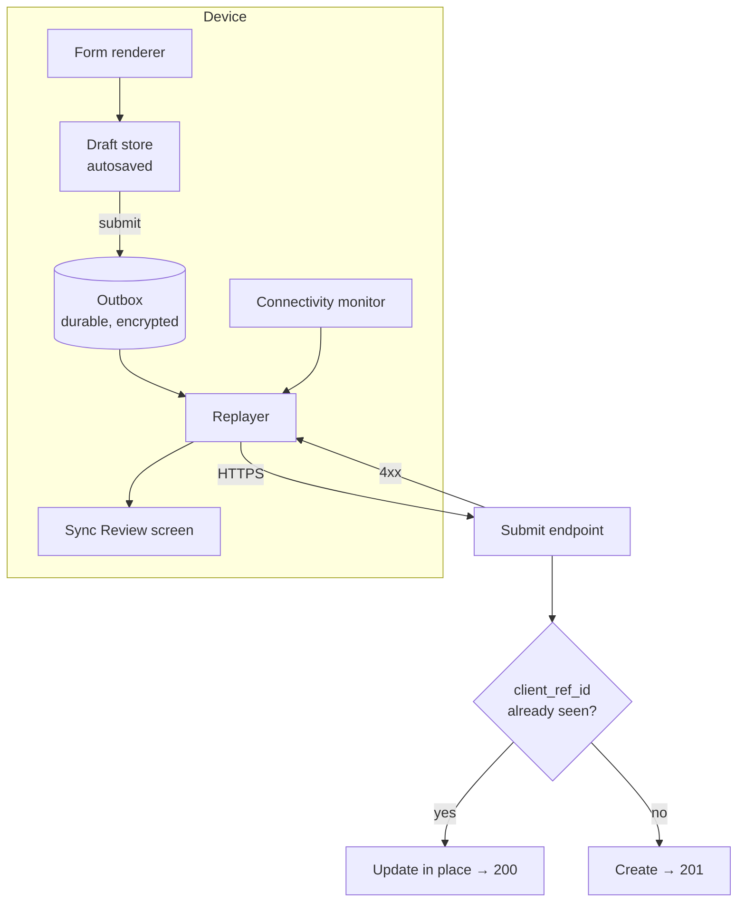
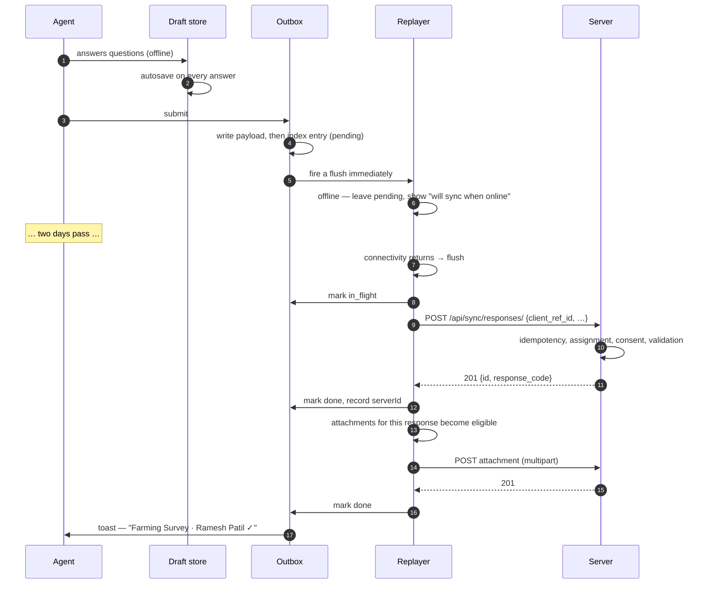

# Offline sync

> **Audience & scope.** Mobile and backend engineers. The most important document in this set after the form schema: how an interview conducted with no connectivity reaches the server exactly once. The wire contract is in [`../api/SYNC_API.md`](../api/SYNC_API.md); the agent-facing behaviour is in [`../guides/AGENT_MOBILE_GUIDE.md`](../guides/AGENT_MOBILE_GUIDE.md).

## The requirement

An agent walks into a village with no signal, conducts eleven interviews over two days, photographs nine plots, and drives home. Every one of those interviews must arrive at the server, exactly once, with its photos, whenever the phone next sees a network — whether that is an hour or a week later. Nothing is lost, nothing is duplicated, and the agent never thinks about any of it.

The design follows the standard three-part sync architecture — **an outbound queue, a processor, and a conflict resolver** — with the simplifications this domain permits.

## The simplification that makes this tractable

> **A survey response is an append-only observation of a moment in time. It is never edited concurrently by two people.**

Compare that with a shared document, where two users editing the same paragraph offline is the normal case and needs convergent replicated data types or an operational transform. Here:

- Only the collecting agent ever touches a response before submission.
- After submission, only a supervisor touches it, and only through explicit review actions.
- The device is the authoritative source until submission; the server is authoritative afterwards.

So there is **no merge problem for the response itself**, and last-write-wins is not a compromise — it is correct. The genuine conflicts are narrower and enumerable: a duplicate respondent, a revoked assignment, a survey closed past its grace window, a version republished under an open draft. Each gets an explicit rule.

---

## Architecture



Four components:

| Component | Job |
|---|---|
| **Draft store** | Holds the in-progress interview. Autosaved on every answer. Not yet a queue item. |
| **Outbox** | The durable queue of submitted work. Survives restarts and reboots. |
| **Replayer** | Walks the queue in order and attempts each item. Single-flight. |
| **Sync Review** | The agent's window into the queue: what is waiting, what failed, what needs a decision. |

---

## Storage layout

The outbox is stored as an **index plus one blob per item**, not as a single serialised list:

```
outbox.index          → an ordered array of lightweight entries
outbox.item.<id>      → the full payload, one key each
```

The reason is a platform detail worth knowing: a single-key write is atomic, but a multi-key write is not on Android. Storing the whole queue under one key means a crash mid-write can corrupt every pending item at once. Splitting payloads out means the worst case is one unreadable item, and the index still knows it exists.

The index entry per item:

```ts
{
  id: string,                  // UUID v4 — also the server-side client_ref_id
  kind: "response.submit" | "response.attachment" | "respondent.create" | "consent.create",
  status: "pending" | "in_flight" | "done" | "failed" | "conflict",
  userId: string,              // whose work this is
  enqueuedAt: string,
  lastAttemptAt?: string,
  attempts: number,
  parentRefId?: string,        // dependency chain
  serverId?: string,           // filled in once the parent lands
  label: string,               // "Farming Survey · Ramesh Patil"
  lastError?: string,
  wasOfflineAtEnqueue: boolean,
}
```

Three fields are doing real work:

- **`id`** is generated on the device and is the idempotency key. The server never generates it.
- **`parentRefId`** builds the dependency chain: respondent → consent → response → attachments.
- **`userId`** is the quarantine key. See below.

All of it is stored encrypted at rest, with the encryption key held in the platform's secure store.

### Write ordering

The payload blob is written **before** the index entry, always. The reverse order leaves a phantom entry pointing at nothing after a crash between the two writes. If the index write fails, the orphan blob is cleaned up best-effort — an orphan blob is invisible and harmless; an orphan index entry is a permanent error in the agent's queue.

---

## The lifecycle of one response



---

## Flush triggers

Five, and each covers a case the others miss:

| Trigger | Covers |
|---|---|
| **App start**, after sweeping stale in-flight items | The app was killed mid-send |
| **Offline → online** | The common case: the agent drives back into coverage |
| **Returning to the foreground** | The phone was in a pocket when signal returned |
| **A periodic heartbeat** (30 s) | Everything the other four missed |
| **Immediately after enqueue** | An online submit must resolve in under a second, not wait up to 30 |

The last one matters more than it looks. Without it, an agent with perfect signal watches a spinner sit idle for up to half a minute, concludes the app is broken, and starts pressing things.

### The boot sweep

An item marked `in_flight` on disk at startup is **provably orphaned** — the in-process "running" flag always starts false, so nothing is actually sending it. Without a sweep back to `pending` at boot, such an item is invisible to automatic retry, to the manual "Sync now" button, *and* to discard. It sits in the queue forever, and the agent has no way to clear it.

Sweeping stale in-flight items to pending before the first flush is three lines of code and removes an entire class of unrecoverable state.

---

## Idempotency

Every item carries a device-generated `client_ref_id`. The server's submit handler:

```
existing = SurveyResponse.objects.filter(client_ref_id=payload.client_ref_id).first()
if existing:
    update_in_place(existing, payload)
    return 200, existing          # ← 200, not 201
create_new(payload)
return 201
```

Enforced by a **partial unique index** on `client_ref_id` where it is not null. Partial, because the web portal and bulk imports create records without one and must not collide on `NULL`.

The distinct status codes matter to the client: `201` means "this is new", `200` means "you already sent this, here it is again". The replayer treats both as success; the analytics can tell them apart, which is how you find out whether retries are actually happening.

Safe retry is what makes the whole design work. The replayer never has to know whether a request that timed out actually arrived.

---

## Dependency chains

A response depends on a respondent, which depends on nothing; attachments depend on the response.

```
respondent.create   (id: A)
consent.create      (id: B, parent: A)
response.submit     (id: C, parent: A)
response.attachment (id: D, parent: C)
response.attachment (id: E, parent: C)
```

The replayer walks in order and, for each item:

1. **No parent** → attempt it.
2. **Parent done** → take the parent's `serverId` and substitute it into the payload, then attempt.
3. **Parent still pending or in flight** → skip; it will be picked up next pass.
4. **Parent failed or in conflict** → cascade the failure. Sending a response whose respondent does not exist produces a worse error than not sending it.

When a parent succeeds, its new `serverId` is written back into the in-pass map, so a child later in **the same pass** already sees it. Otherwise the chain advances by exactly one link per flush, and a four-link chain takes four passes.

---

## Error classification

The single most important logic in the replayer, because getting it wrong means either hammering the server forever or silently discarding real fieldwork.

```
no response at all           → the network failed. Mark offline. Stay pending. Retry.
4xx with a response          → the server refused. Mark FAILED. Do not retry.
5xx with a response          → the server broke. Stay pending. Retry with backoff.
attempts >= 8                → give up. Mark FAILED, keeping the last error.
a known conflict code        → mark CONFLICT. Wait for a human decision.
```

**A 4xx is never retried.** A validation error will fail identically the tenth time, and a queue that retries it forever drains the battery and buries the genuinely retryable items behind it. Failed items stay visible in Sync Review with their error, and the agent retries or discards deliberately.

Backoff on retryable failures is exponential with jitter, capped at five minutes, so a field team coming back into coverage simultaneously does not arrive as a thundering herd.

**A network failure teaches the connectivity monitor.** A request that fails to reach the server is better evidence of being offline than any probe, so the replayer marks the app offline directly from the outcome rather than waiting for the next poll.

---

## Conflicts

A conflict is a rejection a human must resolve. Four exist:

| Code | Cause | Resolution offered |
|---|---|---|
| `duplicate_respondent` | The phone or identity number already exists server-side | **Merge** into the existing respondent (default), **keep both**, or **discard** |
| `no_active_assignment` | The assignment was revoked before the response started | Discard, or contact the supervisor. The work is shown, not thrown away. |
| `survey_closed` | The survey closed more than the grace window ago | Discard, or escalate for a manual accept |
| `duplicate_response` | The survey is one-per-respondent and one already exists | Discard, or replace the existing response |

Conflicts sit at the top of Sync Review, above everything else, with plain-language explanations and buttons. They are never auto-resolved and never retried blindly — a `duplicate_respondent` retried without a decision either creates a duplicate person or loses an interview, and neither is acceptable.

---

## Attachments

Queued as **separate items chained to their response**, for one blunt reason: a 6 MB photo on a 2G connection can take four minutes, and the twelve text answers it accompanies should not wait for it.

| Property | Behaviour |
|---|---|
| Ordering | Sequential per response, not parallel. Parallel uploads on a weak connection all fail together and race the per-tenant rate limit. |
| Compression | Before queueing, not before uploading, so the device stores the smaller file |
| Size and type validation | **At capture**, not at upload. A file that will be rejected must never enter the queue. |
| Checksum | Computed on capture, verified server-side |
| Resumable | Phase 4, for large audio and video |
| Failure | Marks **only the attachment** as failed. The response stays `done`. |

That last row is essential. If an attachment failure marked the whole chain as failed, retrying would resend the response, and — were idempotency ever imperfect — duplicate it. The response has landed; the photo is a separate problem, reported as such: *"Response saved. 1 photo failed to upload — retry in Sync."*

---

## User quarantine

If a different agent signs in on the same device while items are queued, those items are **quarantined**: retained, visible, clearly labelled, and never transmitted under the new user's session.

Sending Agent A's interviews under Agent B's credentials would silently misattribute fieldwork — the responses would be recorded as collected by B, ruining both agents' quality metrics and the audit trail. The quarantine message tells the agent exactly what to do: *"9 items belong to a.kumar@example.com. Sign in as that user to sync them."*

The items are never deleted automatically. Deleting another person's unsent fieldwork is not a decision the app gets to make.

---

## Sync Review

The agent's only window into the queue, and deliberately the only one — a scattering of sync indicators across a dozen screens is how a field team stops trusting an app.

Groups, in fixed order:

1. **Needs attention** — conflicts. Each with an explanation and buttons.
2. **Failed** — will not retry automatically. Error shown; Retry and Discard.
3. **Syncing now** — in flight.
4. **Waiting** — pending, with "enqueued 12 minutes ago · 3 attempts".
5. **Recently synced** — a rolling confirmation window, because seeing the successes is what makes the queue trustworthy.

A "Sync now" button, disabled while offline, and pull-to-refresh that also flushes.

The rest of the app carries exactly one sync surface: a thin status strip showing pending count and offline state, tappable to open this screen.

---

## Downloading form packages

Sync is bidirectional. The device pulls as well as pushes.

```
GET /api/sync/assignments/         → my assignments, each with version id and schema hash
GET /api/sync/packages/<version>/  → the full frozen package
```

- The device compares `schema_hash` against what it holds. Equal means no download.
- Packages are cached indefinitely; a version is immutable, so a cached package can never be stale.
- Old packages are retained while any local draft references them, then pruned.
- Choice lists ship inside the package, so cascading selects work fully offline.

The agent is prompted to update while they still have signal, rather than discovering a missing form in a village.

---

## What is cached for reading

A whitelist, not everything:

| Cached | Not cached |
|---|---|
| The signed-in user and their permissions | Dashboard aggregates |
| Assignments | Other agents' anything |
| Form packages | Reports |
| Respondents in the agent's area (identifiers and names only) | Full respondent records outside the area |
| The agent's own recent responses | |

Dashboards are excluded on purpose: a stale count shown with no indication of its age misleads, and there is no useful offline action to take on it anyway.

Cached data expires after seven days. Every sign-out clears the read cache; only the **outbox survives a soft sign-out**, because unsent work belongs to the agent, not to the session.

---

## Failure scenarios and behaviour

| Scenario | Behaviour |
|---|---|
| Phone dies mid-interview | The draft is autosaved; the agent resumes on restart |
| App killed while sending | The item is in flight on disk; the boot sweep returns it to pending; idempotency makes the resend safe |
| Server returns 500 on submit | Stays pending, retries with backoff |
| Server rejects with a validation error | Marked failed with the message; visible in Sync Review |
| Device storage fills up | Capture is blocked with a clear message before the queue can be corrupted; the agent is prompted to sync and free space |
| The agent uninstalls the app with work queued | **The work is lost.** The app warns prominently whenever the queue is non-empty; there is no other defence, and pretending otherwise would be dishonest. |
| Two devices, same agent, same interview | Two different `client_ref_id` values, so two responses. Detected by duplicate-respondent rules, resolved by a human. |
| The clock on the device is wrong | Server timestamps are authoritative for ordering; the device's `started_at` is retained as reported and flagged when it is implausible |

---

## Testing this properly

Offline behaviour is not testable by clicking around with the network on.

| Test | Method |
|---|---|
| Full offline interview | Airplane mode, complete an interview, confirm the queue |
| Durability | Queue items, force-stop the app, reboot the device, confirm the queue survived |
| Resend safety | Queue an item, submit, kill the app mid-request, restart, confirm **one** server record |
| Poor connectivity | Network conditioning at 2G speeds with packet loss |
| Large queue | 200 responses plus 400 attachments, flushed over a throttled connection |
| Quarantine | Queue as user A, sign in as B, confirm nothing is sent and nothing is lost |
| Conflict resolution | Create the same respondent on two devices, sync both, confirm the conflict and both resolutions |
| Chain integrity | Queue respondent + consent + response + 2 attachments offline, sync, confirm the order and the linkage |

These belong in an automated suite with a mocked network layer, plus a manual pre-release pass on a real low-end device. The automated suite catches regressions; the manual pass catches the things that only show up at 2G on a phone with 2 GB of RAM.

---

*Last reviewed: 2026-09-11. Source of truth: the outbox and replayer modules and their test suite.*
