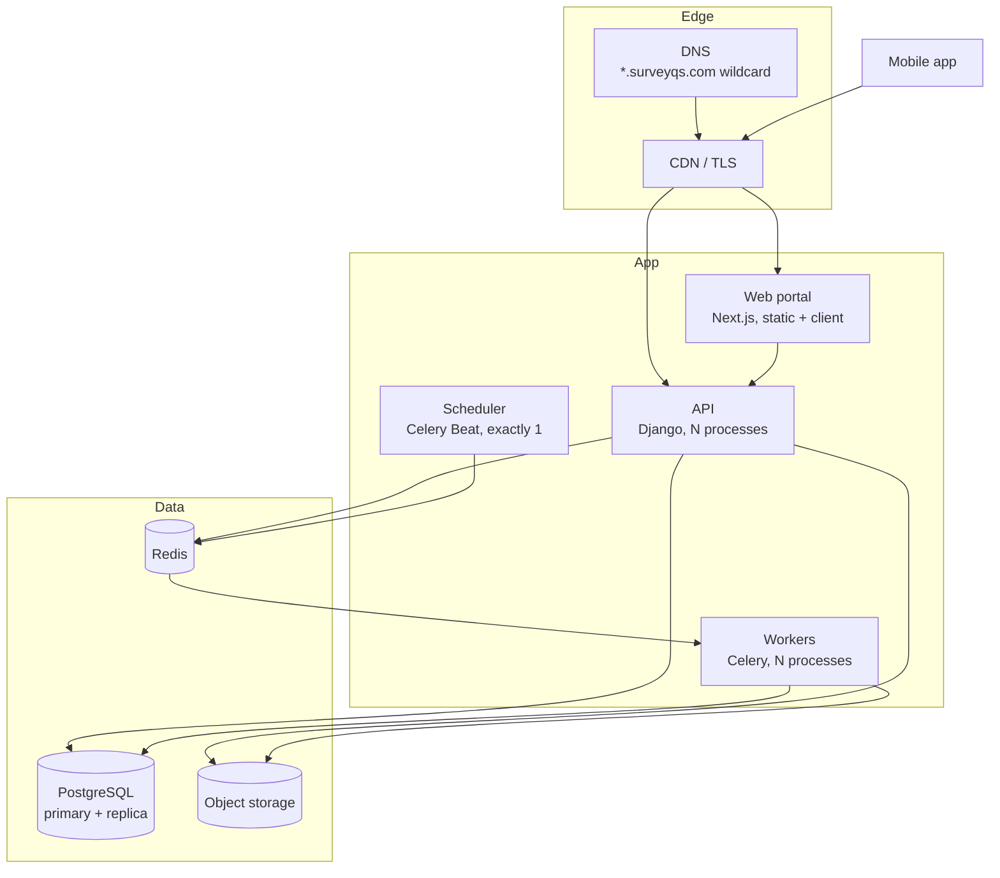

# Deployment

> **Audience & scope.** Whoever deploys and operates SurveyQs. Topology, the release sequence, the per-tenant migration rule, and what to watch. Variables are in [`ENVIRONMENT.md`](./ENVIRONMENT.md); incident procedures in [`RUNBOOK.md`](./RUNBOOK.md).

## Topology



Five deployable units. Exactly one scheduler process, ever — two schedulers means every scheduled job runs twice, which for "send due-date reminders" means every agent gets two notifications and for a retention sweep means something worse.

## DNS and certificates

A **wildcard** record for `*.surveyqs.com`, because tenants are provisioned at runtime and a per-tenant DNS record is not something a provisioning flow can wait for. Certificates must cover the wildcard.

| Host | Serves |
|---|---|
| `surveyqs.com` | Marketing, sign-in |
| `app.surveyqs.com` | Sign-in and the workspace picker |
| `api.surveyqs.com` | The API for the mobile app and anything on a platform host |
| `admin.surveyqs.com` | The superadmin area |
| `abc.surveyqs.com` | One tenant's portal and API |

`app`, `api`, `admin` and `www` are **reserved subdomains** and are refused at tenant creation. A customer who takes `api` breaks the mobile app for everybody.

## Environments

| Environment | Purpose | Data |
|---|---|---|
| Local | Development | Seeded, disposable |
| Preview | Per-branch review | Seeded, disposable |
| Staging | Release rehearsal | Anonymised copy or synthetic |
| Production | Live | Real |

**Staging is not optional for this product.** The per-tenant migration step means a migration can pass locally against one tenant and fail in production against forty. Staging must carry several tenants, including one deliberately left in a not-ready state, so the skip-and-warn path is exercised on every release.

Production data is never copied to a lower environment without anonymisation. It contains named individuals' personal data collected under consent, and that consent does not extend to a developer's laptop.

---

## Release sequence

```bash
set -euo pipefail

python manage.py migrate_schemas --shared --noinput   # 1. the public schema
python manage.py migrate_ready_tenant_schemas         # 2. every ready tenant
python manage.py collectstatic --noinput              # 3.
python manage.py bootstrap_demo_tenant                # 4. no-op unless configured
```

The order is the specification.

**Step 1 before step 2.** Tenant schemas can reference public tables. The reverse order fails on a fresh install and intermittently thereafter.

**Step 2 is not the stock "migrate all tenants" command.** It iterates tenants, checks the schema actually exists, and **skips with a warning** where it does not. One tenant left half-provisioned by a failed creation three weeks ago must not fail the entire release for everybody else. This single behaviour is the difference between a deploy pipeline that works at forty tenants and one that does not.

**Step 4 is idempotent and inert** unless demo variables are set, so it costs nothing in production.

### Migration discipline at N tenants

A migration touching a tenant app runs once per tenant. At forty tenants, a migration that takes four seconds takes nearly three minutes.

| Rule | Why |
|---|---|
| Add columns as nullable; backfill in a background job | A full-table rewrite on a three-million-row `Answer` table, forty times, is a long outage |
| Create indexes concurrently | The same, and it requires a migration that cannot run in a transaction — flag it explicitly |
| Never combine a schema change with a data migration | The schema change must succeed for every tenant before any data moves |
| Test against a staging database with realistic row counts | A migration that is instant against 200 rows is not instant against 3,000,000 |
| Time the migration in staging and publish the number | "The deploy will take eleven minutes" is a reasonable thing to say; discovering it live is not |

### Zero-downtime changes

Deploys are rolling, so old and new code run simultaneously for a period. Every change must be compatible in both directions for one release:

1. **Release N** adds the new column or field, writes to both, reads from the old.
2. **Release N+1** reads from the new, still writes both.
3. **Release N+2** stops writing the old and drops it.

Renaming a column in a single release breaks every request served by an old process for the duration of the deploy.

---

## Scaling

| Component | First lever | Notes |
|---|---|---|
| API | More processes | Stateless; scales horizontally without ceremony |
| Workers | More processes, then separate queues | Exports are long-running and should not block notifications |
| Scheduler | **Never more than one** | |
| Database | Vertical, then a read replica for reports | Reporting queries are the heaviest read load |
| Redis | Vertical | It is a queue and a cache, not a data store |
| Object storage | Managed | Attachments dominate storage growth |

Queues, separated by workload shape:

| Queue | Work | Character |
|---|---|---|
| `default` | Quality flags, attachment processing | Short, frequent |
| `exports` | Export generation | Long, occasional, memory-hungry |
| `imports` | Bulk uploads | Long, occasional |
| `notifications` | Fan-out and delivery | Short, bursty |
| `scheduled` | Reminders, sweeps | Predictable |

Separating exports matters: one 80,000-row export must not delay every agent's submission notification for four minutes.

---

## What to monitor

### Availability
Uptime on the API, the portal and a synthetic end-to-end submission.

### The numbers that matter for this product

| Metric | Why | Alert when |
|---|---|---|
| **Sync submission success rate** | The product's core promise. A drop means agents' work is not landing. | Below 99% over 15 minutes |
| **Rejected submissions by code** | A spike in `validation_failed` usually means a bad survey was just published | Any sustained spike |
| **`200` versus `201` on submission** | The ratio of retries to fresh submissions. Rising retries mean network trouble or a replayer bug | Retries above 10% |
| **Attachment upload failure rate** | Photos failing while responses succeed | Above 2% |
| **Oldest pending item across devices** | From the heartbeat. Surfaces a field team quietly out of contact | Any device over 7 days |
| **Export job duration** | | 95th percentile above 5 minutes |
| **Worker queue depth** | | Sustained growth |
| **Tenants not ready** | Somebody cannot start | Above zero for an hour |
| **Database connections, replication lag, disk** | Standard | Standard thresholds |

The first five are specific to SurveyQs and are the ones a generic monitoring setup will not give you.

### Logging
Structured, with a request id on every line. No personal data, no tokens, no answer content in logs. Error tracking scrubs request bodies on authentication and submission endpoints.

---

## Backups

| What | Frequency | Retention | Verified |
|---|---|---|---|
| Database | Continuous with point-in-time recovery | 30 days | **Monthly restore test** |
| Object storage | Versioned with cross-region replication | 90 days | Quarterly |
| Configuration | In version control | Indefinite | — |

An untested backup is a belief, not a backup. The monthly restore drill is: restore to an isolated instance, run the migration check, open one tenant, confirm a response reads correctly with its attachments. Half an hour, once a month, and it is the only thing standing between an incident and a catastrophe.

---

## Deploy checklist

**Before**

- [ ] Tests pass, including the tenant-isolation test and the shared expression fixtures
- [ ] Migrations reviewed for destructive operations
- [ ] Migration timed against realistic row counts in staging
- [ ] Backwards compatibility confirmed for a rolling deploy
- [ ] Mobile schema compatibility confirmed if the form package changed
- [ ] Staging deployed and exercised, including a not-ready tenant

**During**

- [ ] Watch migration output for skipped tenants — investigate every one
- [ ] Watch error rates for ten minutes after processes recycle

**After**

- [ ] Synthetic submission succeeds
- [ ] Sync success rate unchanged
- [ ] Worker queues draining
- [ ] Tenants-not-ready still zero

**Rolling back**

Code rolls back by redeploying the previous build. **Migrations do not.** This is why additive-only migrations matter: a forward-compatible schema lets code roll back without touching the database. A migration that dropped a column cannot be reversed without data loss, which is the entire argument for the three-release rename.

---

*Last reviewed: 2026-09-11. Source of truth: the infrastructure configuration and the release script.*
