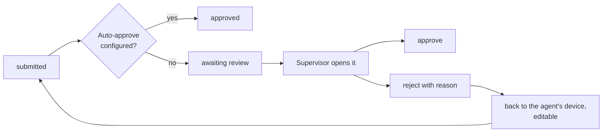

# Data quality

> **Audience & scope.** Supervisors who have to trust a dataset they did not collect, and engineers implementing metadata capture, flags and the review workflow. Requirements: [`FUNCTIONAL_SPEC.md`](./FUNCTIONAL_SPEC.md) §11 and §10.

## The problem being solved

An interviewer-administered survey has a failure mode that self-completed surveys do not: the interview may not have happened. Not necessarily through dishonesty — an agent behind on a target at the end of a long day is in a situation where inventing five responses is very tempting and, on paper, undetectable.

Mature field-survey tools converged on the same answer: **capture passive metadata about how the interview was conducted, and make the anomalies visible**. Timings, location, device behaviour. None of it proves fabrication; all of it makes fabrication hard to sustain, and — the more useful effect in practice — makes *honest* mistakes visible too.

The design principle throughout: **flags are prompts to look, never automatic verdicts.** A flag that auto-rejects punishes an agent whose phone lost GPS in a building. A flag that surfaces a response for a two-minute human look costs almost nothing and catches almost everything.

---

## Metadata captured on every response

Automatically, with no agent action:

| Field | Captured | Why it is useful |
|---|---|---|
| `started_at` | When the first question was opened | With `submitted_at`, gives duration |
| `submitted_at` | When the agent pressed submit | |
| `duration_seconds` | The difference | **The single most informative quality signal** |
| `gps_point` + `gps_accuracy_m` | On starting, and optionally on submitting | Where the interview happened, and how confident the fix is |
| `gps_captured_at` | When the fix was taken | Detects a stale fix reused across responses |
| `device_id` | Stable per installation | Detects many responses from one device that should be several |
| `app_version`, `os_version` | | Correlates a bug with the responses it affected |
| `survey_version_id` | The pinned version | Correctness, not just quality |
| `collected_by` | The agent | |
| `assignment_id` | Which assignment it counts toward | |
| `was_offline` | Whether it was captured without connectivity | Explains a delayed submission before anyone asks |
| `submitted_from_ip` | Server-side, at sync | |
| `section_durations` | Seconds per section (P4) | Locates *where* a fast interview was rushed |

A deliberate omission: SurveyQs does **not** track an agent's location continuously between interviews. The GPS point is captured at the moment of the interview and no other time. Continuous tracking of employees is a different product with different consent requirements, and mixing it in would be a serious overreach.

---

## Automatic flags

Configurable rules, evaluated server-side when a response arrives. Each flag names the rule, its severity, and what triggered it.

| Flag | Default rule | What it usually means |
|---|---|---|
| **Too fast** | Duration below 40% of the median for this survey version | Rushed, or not conducted. The most reliable single signal. |
| **Implausibly fast** | Duration below the sum of minimum plausible answer times | Almost certainly not conducted as an interview. |
| **Poor GPS** | Accuracy worse than 100 m, or no fix at all | Often innocent — indoors, dense canopy. Worth checking against the pattern. |
| **Outside area** | GPS outside the agent's assigned area by more than a tolerance | Wrong village, or a copied location. |
| **Duplicate location** | Same coordinates to 5 decimal places as another response by the same agent | Several interviews reported from one exact spot. |
| **Out of hours** | Submitted outside the tenant's configured working hours | Not suspicious alone; suspicious combined with speed. |
| **Straightlining** | An identical option chosen for every row of a matrix, or for a long run of same-scale questions | Fatigue, or a respondent giving up. Also a signal the questionnaire is too long. |
| **High refusal rate** | Optional questions skipped far above this agent's own baseline | A rushed interview, or a badly worded question. |
| **Low variance** | An agent's answer distribution is markedly narrower than their peers' on the same survey | A pattern signal, raised on the agent, not on one response. |

Every threshold is tenant-configurable, and every default is a starting point to be tuned against the first few hundred real responses. Shipping with untunable thresholds is how a quality system becomes noise that supervisors learn to ignore.

**Flags never block submission.** They are attached after the response is stored. An agent is never told "your response was flagged", because that teaches them precisely which threshold to stay above.

---

## Audio audits (Phase 4)

The strongest available fabrication check: with the respondent informed in the consent notice, the app records short audio snippets at random points during the interview.

- Snippets, not the full interview — enough to confirm that a conversation took place, far less intrusive and far smaller to upload.
- **Disclosed in the consent notice**, always. Undisclosed recording is not acceptable in any jurisdiction and not acceptable to us.
- Configurable per survey, off by default.
- Reviewed by sampling, not exhaustively; the deterrent works because it *could* be checked.

Placed in Phase 4 because it is heavy — storage, upload volume, a review interface — and because duration plus GPS already catches most of what it catches.

---

## The review workflow

### What the supervisor sees

The review queue, sorted with flagged responses first, showing per response: the agent, survey, date, duration against the survey's median, flags, and a summary line of key answers.

Opening one shows: every answer rendered against its pinned version; attachments; the GPS point on a map with the assigned area drawn around it; the full timing strip; the respondent; and the complete audit trail.

### Rejecting

A reason is **required**, chosen from a tenant-configurable list plus free text:

- Incomplete or inconsistent answers
- Photo missing, unclear, or of the wrong subject
- Location does not match the assigned area
- Suspected not conducted
- Duplicate of another response
- Other (free text required)

The reason goes to the agent's device with the response, and the response becomes editable. The agent corrects and resubmits **the same response** — same id, same original collection date, with a full history of both passes.

### Bulk review

Approving 140 clean responses one at a time is not a workflow anybody will follow, so bulk approve is available on a filtered selection with a confirmation naming the count. Bulk **reject** is deliberately *not* offered: rejecting requires a reason, and a reason applied to forty responses at once is not a reason.

---

## The supervisor dashboard

Per agent, for a chosen period:

| Metric | Reading |
|---|---|
| Responses submitted | Volume |
| Approved / rejected / awaiting | Throughput and quality |
| Rejection rate | Rising is the earliest warning available |
| Median duration vs. the team's | The headline fabrication signal |
| Flag rate by flag type | Distinguishes one bad day from a pattern |
| Days since last sync | Catches a broken device before a week of work is at risk |
| Progress against target | Work, not just quality |

The most valuable view here is **comparative**: one agent's median duration of 6 minutes against a team median of 19 says more than any absolute threshold. Absolute thresholds vary by survey, by region, by respondent; peer comparison self-calibrates.

---

## Preventing bad data at the point of capture

Every check above is detection. Prevention is cheaper, and it is mostly a survey-design property:

| Technique | Where it lives |
|---|---|
| Constraints with actionable messages | [`FORM_LOGIC.md`](./FORM_LOGIC.md) — "Age must be between 18 and 120", not "Invalid value" |
| Validation on the device, at section advance | The respondent is still present; a correction is free |
| Skip logic instead of "not applicable" | An irrelevant question is not shown, so it cannot be mis-answered |
| Required photos and GPS on evidence questions | Hard to fabricate a plot photo with plausible coordinates |
| Cascading choices | A district in the wrong state becomes unrepresentable |
| Duplicate detection at the point of entry | Cheaper than merging records later |
| A realistic questionnaire length | The builder warns above 60 questions or an estimated 35 minutes. Fatigue produces more bad data than dishonesty does. |

That last row deserves emphasis. Most straightlining is not misconduct; it is a respondent forty minutes into a survey that should have taken twenty.

---

## What quality control is not

- **Not a verdict machine.** Every flag ends in a human decision.
- **Not surveillance.** Metadata about an interview is captured. An agent's movements between interviews are not.
- **Not a substitute for supervision.** The most effective quality control in field research remains a supervisor who accompanies an agent occasionally and re-contacts a sample of respondents. The dashboard tells them *whom* to accompany.
- **Not hidden from agents.** The metrics a supervisor sees should be visible to the agent about themselves. Quality systems that operate in secret produce gaming; ones that are transparent produce improvement.

---

*Last reviewed: 2026-09-11. Source of truth: [`FUNCTIONAL_SPEC.md`](./FUNCTIONAL_SPEC.md) §11. Techniques drawn from established field-survey practice; sources in [`../reference/RESEARCH_NOTES.md`](../reference/RESEARCH_NOTES.md).*
