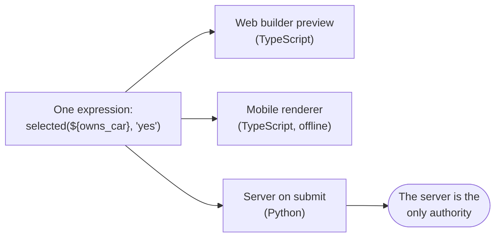

# Form logic

> **Audience & scope.** Admins building conditional surveys, and engineers implementing the evaluator. Defines the expression language, relevance (skip logic), constraints, required rules, defaults, calculations, repeat groups and cascading choices. Question types are in [`QUESTION_TYPES.md`](./QUESTION_TYPES.md); the stored JSON is in [`../architecture/FORM_SCHEMA.md`](../architecture/FORM_SCHEMA.md).

## The governing constraint

The same expression must produce the same result in three places:



Two implementations that drift is the single most common failure in this product category, and it fails quietly: the agent's app shows question 12, the server decides question 12 was irrelevant and discards the answer, and nobody notices for three weeks.

Four design decisions follow from that, and they are why the language below is deliberately small:

1. **Small surface.** A fixed operator set and a fixed function list. No arbitrary code, no regular-expression dialect differences, no locale-dependent behaviour.
2. **One grammar, one test suite.** The evaluator is specified once and shipped as a shared package used by web and mobile; the server implements the same grammar against **the same table of test cases**, which is part of the repository and runs in both CI jobs.
3. **The server always re-evaluates.** It never trusts the client's view of which questions were relevant. Answers to questions the server judges irrelevant are discarded with a warning, not accepted.
4. **No expression can reach outside the response.** No database lookups, no network, no current-user checks. An expression is a pure function of the answers so far plus a handful of constants.

---

## 1. The expression language

### Literals

| Kind | Example |
|---|---|
| Number | `42`, `3.5`, `-1` |
| Text | `'yes'`, `"none"` — single or double quotes |
| Boolean | `true`, `false` |
| Empty | `null` — an unanswered question |

### References

`${question_code}` reads the current value of another question. Rules:

- A reference must point at a question **earlier in the form**, or at the current question inside a `constraint` (where `.` is also available, meaning "the value just entered").
- A reference to an unanswered question yields `null`.
- A reference to a question that is currently **irrelevant** yields `null`, never its stale value.
- Inside a repeat group, an unqualified reference resolves to the current repeat instance. To reach outside, use `${../question_code}`.
- Forward references are rejected at publish time (FR-SURV-13), not at runtime.

### Operators

| Group | Operators |
|---|---|
| Comparison | `=`, `!=`, `<`, `<=`, `>`, `>=` |
| Logical | `and`, `or`, `not(...)` |
| Arithmetic | `+`, `-`, `*`, `/`, `mod` |
| Grouping | `( )` |

Comparison is type-aware: comparing a number to a number is numeric, text to text is exact and case-sensitive. Comparing across types is a publish-time error, so `${age} = 'yes'` never ships.

### Functions

The complete list. Nothing else is available, and this is on purpose.

| Function | Returns |
|---|---|
| `selected(${q}, 'value')` | true if `value` is chosen. Works for single and multiple choice. **The correct way to test a multi-select** — `${q} = 'a'` on a multi-select is a publish-time error. |
| `count_selected(${q})` | how many options are selected |
| `count(${repeat})` | how many instances a repeat group has |
| `sum(${repeat}/field)` | sum of a field across repeat instances |
| `if(cond, a, b)` | `a` when the condition is true, else `b` |
| `coalesce(a, b, …)` | the first non-null argument. **Required for arithmetic on optional numbers** — `${x} + ${y}` where `y` is unanswered is not a number. |
| `is_empty(${q})` / `not_empty(${q})` | null or blank test |
| `today()` | today's date on the device |
| `now()` | the current timestamp |
| `date_diff(a, b, 'days'\|'months'\|'years')` | signed difference |
| `age(${dob})` | whole years from a date of birth to today — shorthand for the commonest calculation in any survey |
| `length(${q})` | string length, or array length for a multi-select |
| `matches(${q}, 'pattern')` | a documented restricted pattern syntax (anchored, no backreferences, no lookaround), so every platform behaves identically and no pattern can run away |
| `number(${q})` / `int(${q})` / `text(${q})` | explicit conversion |
| `round(n, places)`, `min(a,…)`, `max(a,…)`, `abs(n)` | arithmetic helpers |
| `contains(${q}, 'sub')`, `starts_with`, `ends_with` | substring tests |
| `upper(${q})`, `lower(${q})`, `trim(${q})` | text helpers |

### Null handling — the rule that prevents most mistakes

`null` propagates. Any arithmetic touching a `null` produces `null`, not zero, and a comparison against `null` is false rather than an error.

```
${income_a} + ${income_b}                       → null if either is unanswered
coalesce(${income_a},0) + coalesce(${income_b},0) → a real number
```

The builder **warns** when it sees arithmetic on a question that is not required, and offers to wrap it in `coalesce()`. Silently treating unanswered as zero is worse than either alternative: it makes missing data invisible in the totals.

---

## 2. Relevance — skip logic

`relevant` is a boolean expression on a question or a section. True shows it; false skips it.

```
# ask the model only of car owners
question: car_model
relevant: selected(${owns_car}, 'yes')

# ask the follow-up only of unhappy respondents
question: dissatisfaction_reason
relevant: ${satisfaction_rating} <= 2

# a whole section for households with children
section: Children
relevant: ${has_children} = true and ${child_count} > 0
```

### What "not relevant" means, precisely

A question that is not relevant is:

- **not shown**;
- **not required**, even if `required` is true;
- **not validated** — its constraint does not run;
- **not stored** — any value previously entered is cleared from the submission.

That last point is the one that surprises people, and it is correct. If the respondent says they own a car, names a model, then corrects themselves to "no car", the model answer must not survive into the data. The app warns before clearing when a visible answer exists ("Changing this will clear 2 answers"), because a silent deletion is alarming; but it does clear.

### Section relevance

A section whose `relevant` is false is skipped entirely — the agent never sees that screen, and every question inside it is irrelevant regardless of its own condition. Section-level skips are the efficient way to branch, and the builder nudges toward them when several consecutive questions share a condition.

### Guarantees checked at publish time

- No forward references.
- No cycles (`a` relevant on `b`, `b` relevant on `a`).
- No required question inside a section that can never be relevant.
- A warning, not an error, when a condition can never be true given the referenced question's choice list — for example testing for an option that was deleted.

---

## 3. Constraints and required

### `required`

The question must be answered before advancing. `required_message` customises the wording. `required` may itself be an expression, which is how "required only if" is expressed:

```
question: spouse_name
required: ${marital_status} = 'married'
```

### `constraint`

A condition the answer must satisfy. `.` means the value just entered. Failing shows `constraint_message` and blocks the advance.

```
question: age
constraint: . >= 18 and . <= 120
constraint_message: Age must be between 18 and 120.

question: harvest_date
constraint: . <= today()
constraint_message: Harvest date cannot be in the future.

question: end_date
constraint: . >= ${start_date}
constraint_message: End date must be on or after the start date.
```

**A constraint never runs on a blank answer.** Emptiness is `required`'s job. Conflating the two produces the worst error message in survey software: "Age must be between 18 and 120" on a field the respondent simply declined to answer.

**`constraint_message` is mandatory** whenever a constraint is set. The builder refuses to publish a constraint without one — because "Invalid value" is not something an agent can act on while sitting in front of a respondent.

### Type-level validation

Some rules are configuration on the question rather than an expression, because they are common enough to deserve a field in the builder: `min` / `max` on numbers, `max_length` on text, `min_date` / `max_date`, `min_selections` / `max_selections`, `accepted_types` and `max_size_mb` on files. These compile down to constraints internally, and a default message is generated. An admin who needs something more specific writes an expression instead.

### Where validation runs

| Where | What it checks | Why |
|---|---|---|
| **The device, on advancing a section** | Everything: required, constraints, type rules | The agent is standing in front of the respondent. This is the only moment a correction is cheap. |
| **The device, on final review** | Everything again, across all sections | Catches a question made required by a later answer. |
| **The server, on submit** | Everything again, from scratch, against the pinned version | The client can be out of date, modified, or simply wrong. |

The server's re-evaluation is not a formality. It re-derives which questions were relevant, validates only those, discards answers to irrelevant questions with a warning, and rejects the submission if a relevant required question is missing. See [`../api/SYNC_API.md`](../api/SYNC_API.md) for the rejection shape.

---

## 4. Defaults

**Static** — a fixed value pre-filled before the respondent answers:
```
question: country
default: 'India'
```

**Dynamic** — an expression evaluated **once**, when the response is created:
```
question: interview_date
default: today()

question: village
default: ${respondent.village}     # pre-loaded from the respondent record
```

A default is not a calculation. It is a starting value the agent may overwrite, and it is not recomputed when its inputs change. If you want a value that tracks its inputs, use `calculate`.

---

## 5. Calculations

A `calculate` question is hidden, has no widget, and stores the result of its expression. It re-evaluates continuously as the form is filled.

```
question: total_income     type: calculate
calculation: coalesce(${farm_income},0) + coalesce(${other_income},0)

question: respondent_age   type: calculate
calculation: age(${date_of_birth})

question: yield_per_acre   type: calculate
calculation: if(${area_acres} > 0, ${total_yield} / ${area_acres}, null)
```

Calculations serve two purposes: deriving values worth storing, and **naming intermediate results so logic stays readable**. `relevant: ${total_income} < 50000` is a far better artefact than the same arithmetic inlined into six different conditions.

Circular calculations are rejected at publish time. Calculations are exported as ordinary columns.

---

## 6. Repeat groups

A repeat group asks a set of questions once per item.

```
repeat: children
  label: Children in the household
  count_mode: from_answer
  count_expression: ${number_of_children}
  max_instances: 15

  question: child_name    type: text     required: true
  question: child_age     type: integer  constraint: . >= 0 and . <= 25
  question: child_school  type: yes_no   relevant: ${child_age} >= 5
```

### Count modes

| Mode | Behaviour |
|---|---|
| `agent_controlled` | An "Add another" button; the agent decides. The default and the most common. |
| `fixed` | A set number of instances. |
| `from_answer` | Driven by an earlier answer. Reducing that answer after instances exist prompts before discarding the extras — never silently. |

`max_instances` is always enforced, whatever the mode, so a mis-keyed "300 children" cannot produce a 300-screen form.

### References inside a repeat

- `${child_age}` — the current instance.
- `${../household_income}` — outside the repeat.
- `count(${children})` — how many instances exist.
- `sum(${children}/child_age)` — an aggregate across instances, usable outside the repeat.

### On mobile

Each instance is a card in a list with a summary line ("Child 1 — Asha, 7"), tap to edit, swipe to remove with confirmation, and an "Add another" button. Instances are **not** one long scroll; the list-of-cards shape is what keeps a ten-instance repeat navigable on a phone.

### Nested repeats

Supported to two levels (a repeat inside a repeat), but the builder warns. A three-level nest means the questionnaire design needs revisiting, not that the tool needs another level.

---

## 7. Cascading choices

A later choice question is filtered by an earlier answer. The classic case is geography.

```
choice_list: districts
  columns: value, label, state
  rows:
    - [d_pune,   Pune,   s_mh]
    - [d_nashik, Nashik, s_mh]
    - [d_surat,  Surat,  s_gj]

question: state     type: select_one   choice_list: states
question: district  type: select_one   choice_list: districts
                    choice_filter: state = ${state}
```

Rules:

- Changing the parent **clears the child**, with a warning if the child was answered. Any other behaviour leaves impossible combinations in the data — a district in the wrong state.
- Filter attributes are plain columns on the choice list; the filter is a simple equality or `and` of equalities, not a general expression. The restriction is what lets a 5,000-row choice list filter instantly on a low-end phone.
- The whole filtered list ships in the form package, so cascading works fully offline. Above a size threshold the builder warns about the package size and suggests a searchable appearance instead.

---

## 8. Read-only

`read_only: true` displays a value without allowing edits. Combined with a `default` it shows pre-loaded context — the respondent's name from their record, or the assignment's target village — so the agent can confirm rather than retype. Read-only questions can still be `relevant` and are still exported.

---

## 9. Worked example — the Car Ownership Survey

```
section: Screening
  question: owns_vehicle
    type: yes_no
    label: Do you own a vehicle?
    required: true

  question: no_vehicle_reason
    type: select_one   choices: [too_expensive, no_licence, use_transit, other]
    label: Why not?
    relevant: ${owns_vehicle} = false
    required: true

section: Vehicle details
  relevant: ${owns_vehicle} = true

  question: vehicle_count
    type: integer   required: true
    constraint: . >= 1 and . <= 10
    constraint_message: Please enter between 1 and 10 vehicles.

  repeat: vehicles
    count_mode: from_answer
    count_expression: ${vehicle_count}

    question: make          type: select_one  choice_list: makes   required: true
    question: model         type: select_one  choice_list: models  choice_filter: make = ${make}
    question: year          type: integer     constraint: . >= 1980 and . <= year(today())
    question: is_electric   type: yes_no
    question: battery_range type: integer     relevant: ${is_electric} = true
                            constraint: . > 0 and . <= 1000
    question: photo         type: image       max_count: 1   source: camera_only

  question: total_vehicles  type: calculate
    calculation: count(${vehicles})

section: Satisfaction
  relevant: ${owns_vehicle} = true

  question: nps            type: nps    required: true
  question: nps_reason     type: long_text
    label: What is the main reason for your score?
    required: true
```

What this demonstrates, in order: a screening question that branches the whole interview; a section-level skip so the agent never sees five irrelevant screens; a constrained count driving a repeat; a cascading filter inside that repeat; a question relevant to a value inside its own instance; a calculation naming a derived total; and a follow-up made required so an NPS score is never collected without its reason.

---

## 10. What the builder shows the admin

Expressions are written in a **guided editor**, not a blank text box:

- A condition builder for the common shapes — "show this when `owns_vehicle` is `Yes`" — producing the expression underneath.
- Autocomplete over the questions available at that point, so a forward reference is impossible to type.
- Live validation with the error under the field.
- A **test panel**: set sample answers, see whether the condition resolves true, before publishing.
- An advanced mode with the raw expression, for anything the builder cannot express.

The raw language is the contract; the builder is the ergonomics. An admin who never opens advanced mode should still be able to build the car survey above.

---

*Last reviewed: 2026-09-11. Source of truth: the shared evaluator package and its cross-platform test-case table.*
