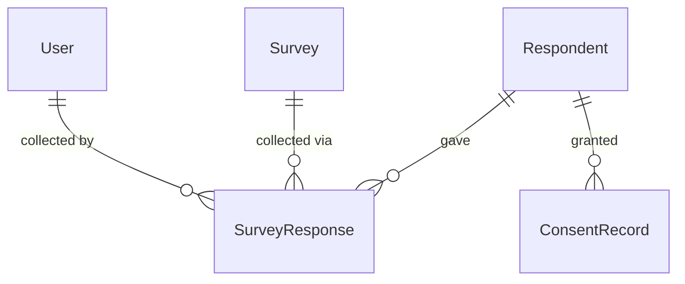
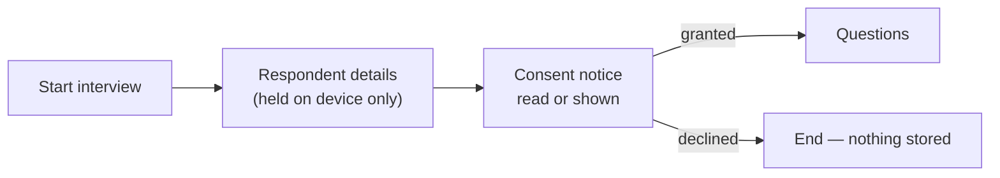

# Respondents and consent

> **Audience & scope.** Admins configuring what gets collected about people, and engineers implementing the respondent and consent modules. Covers the respondent record, deduplication, anonymous surveys, consent capture and withdrawal, and PII handling. Requirements: [`FUNCTIONAL_SPEC.md`](./FUNCTIONAL_SPEC.md) §7. Security controls: [`../architecture/SECURITY_AND_PRIVACY.md`](../architecture/SECURITY_AND_PRIVACY.md).

## Why respondents are a separate record

Your description says agents collect "user informations" alongside the answers. The obvious implementation — a few name and phone fields at the top of every response — breaks in three predictable ways:

1. **The same person, interviewed twice**, becomes two unrelated records with no way to connect them.
2. **A correction** — a mistyped phone number — has to be made on every response separately.
3. **Consent and withdrawal** attach to a *person*, not to an interview. "Delete my data" means all of it.

So the respondent is its own record, reusable across surveys and across time, and the response points at it.

One respondent, many responses, across many surveys. One consent trail per respondent.

---

## What a respondent record holds

The field set is **configurable per tenant** (FR-SET-2), because a farming cooperative and an electronics brand need different things. The shipped default:

| Field | Default | PII? | Notes |
|---|---|---|---|
| Full name | Required | Yes | |
| Phone | Required | Yes | Stored in international format so deduplication works regardless of how it was typed |
| Alternate phone | Optional | Yes | |
| Email | Optional | Yes | |
| Gender | Optional | No | Tenant-defined options, always including a decline choice |
| Age or date of birth | Optional | Partially | Date of birth is PII; a banded age is not |
| Identity number | Optional | Yes | Tenant labels it (national id, customer id, member number) |
| Address | Optional | Yes | |
| Geography | Optional | No | State / district / village from the tenant's hierarchy |
| GPS of the interview | Auto | No | Captured on the response, not the respondent |
| Notes | Optional | Yes | Free text; treated as PII because agents write anything in it |
| Created by / at | Auto | No | Which agent first recorded them |

Each field can be switched off, made required, relabelled, and marked as PII. **Marking a field as PII is what drives masking and deletion**, so it is not cosmetic.

---

## Deduplication — the part that has to work offline

An agent revisiting a village will meet people who were interviewed six months ago. Creating a second record is not merely untidy: it breaks one-response-per-respondent rules, splits a person's consent history, and inflates counts.

The detection rule, in order:

1. **Exact match on phone** (normalised) — treated as the same person.
2. **Exact match on identity number** — treated as the same person.
3. **Fuzzy name plus geography** — surfaced as "possibly the same person", never auto-merged.

### Offline detection

The device maintains a local lookup index of phone numbers and identity numbers for respondents in the agent's area, rebuilt from any successful respondent fetch. When the agent types a phone number with no connectivity, the app checks the index and offers the match.

The index holds **only the identifiers and a display name** — not full records — which keeps it small and limits the exposure if the device is lost.

### When the index misses

Offline detection is best-effort by definition; a respondent first recorded by another agent an hour ago will not be in it. The server therefore re-checks on submission, and a collision produces a **conflict** in Sync Review (not a silent failure, and not a duplicate record), offering:

- **Merge** — attach this response to the existing respondent, and keep the fields the agent captured if the existing record was blank. The default.
- **Keep both** — genuinely different people who share a phone. Records why, so a later audit can see it was deliberate.
- **Discard** — the interview was a mistake.

No automatic merge happens without a human choosing it. Two people who share a household phone are common enough that silent merging would corrupt real data.

---

## Anonymous surveys

Some surveys should not collect identity at all — a satisfaction study where anonymity raises honesty, or any case where the customer has no lawful basis to hold names.

Setting `anonymous: true` on a survey means:

- No respondent record is created or linked.
- The consent step, if required, collects consent without an identity, recording the notice version, timestamp and method only.
- Deduplication is unavailable, and one-response-per-respondent cannot be enforced. The builder states this plainly when the setting is switched on.
- Exports contain no identity columns.

The response still records **which agent** collected it, the GPS and the timings. Anonymity protects the respondent, not the interviewer; without agent attribution there is no quality control at all.

---

## Consent

Where agents collect personal data from people, consent is both an ethical baseline and, in India under the Digital Personal Data Protection Act, a legal requirement with specific properties. The Act requires consent that is free, specific, informed, unconditional and unambiguous, given by a clear affirmative action, preceded by a notice describing what data is collected and why, presented in clear and plain language, with the option to have that notice in English or a listed Indian language. Children's data requires verifiable guardian consent.

SurveyQs is built so a tenant can satisfy that, and so can demonstrate it afterwards.

### The consent step

Consent comes **before** any personal data is stored, as its own screen between identifying the respondent and starting the questions.

Declining ends the interview and **stores nothing**, not even the name already typed. Anything else makes the consent meaningless.

### What a consent record stores

| Field | Purpose |
|---|---|
| Respondent | Who consented (absent for anonymous surveys) |
| Notice version | Exactly which wording they agreed to |
| Language | Which language the notice was presented in |
| Granted at | Timestamp |
| Method | `verbal_confirmed`, `signature`, `checkbox`, `uploaded_form` |
| Signature / document | The attachment, where the method produced one |
| Captured by | Which agent |
| Captured offline | Whether it was recorded without connectivity |
| Purposes | Which stated purposes were agreed to |
| Integrity hash | A hash over the record's fields, so later tampering is detectable |

### Notice versioning

The notice text is versioned like a survey. Changing it creates a new version; every consent record points at the version in force when it was given. Asked in 2028 what a respondent agreed to in 2026, the answer is exact rather than reconstructed.

### Configuration per survey

| Setting | Effect |
|---|---|
| `consent_required: true` | The app cannot proceed without it; the server rejects a response with no consent record |
| `consent_method` | Which capture methods are acceptable |
| `consent_notice_id` | Which notice to show — surveys with different purposes need different notices |
| `guardian_consent_if_minor` | When the respondent's age is under the configured threshold, require guardian details and consent instead |

---

## Withdrawal and erasure

A respondent can withdraw consent at any time. Withdrawal is recorded, never a deletion of the consent history — the record of having consented, and then withdrawn, is itself the evidence.

An admin then chooses what happens to the collected data:

| Action | Effect |
|---|---|
| **Exclude** | The respondent is skipped by future assignments; existing data is retained. For a withdrawal of future contact only. |
| **Anonymise** | Every field marked as PII is cleared on the respondent and across their responses; the answers and the statistics survive. **The default and the recommended action.** |
| **Delete** | The respondent and all their responses are removed. Counts change; the audit log retains the fact of the deletion, its actor and its reason, but not the data. |

Anonymise is the default because it satisfies the person's interest — their identity is gone — without destroying the research the data supports.

Every one of the three is audited with actor, timestamp and reason. Anonymise and delete both require a typed confirmation.

---

## PII masking

Fields marked as PII can be masked for roles configured with masking on — typically the Analyst role, and any external partner.

- In the UI, a masked field renders as `•••` with the last two characters shown for phones, so a support conversation is still possible.
- In exports, masked columns are omitted entirely rather than blanked, so nobody mistakes an empty column for missing data.
- Masking is applied **server-side**. The masked user's API responses never contain the real values, so it cannot be defeated by reading the network tab.
- Every access to unmasked PII by a non-admin role is written to the audit log.

---

## Bulk import (Phase 4)

Where a customer already has a respondent list — members, customers, a sample frame — it can be uploaded: upload a spreadsheet, map its columns to respondent fields, preview with per-row validation errors, then commit. Imported respondents can be pre-assigned to agents, so the app shows each agent their own call list rather than requiring them to type names.

Two guards on import:

- Consent is **not** importable as a tick box. A row can carry a reference to consent obtained outside the system, and the import records that reference; it never fabricates a consent record with a timestamp that did not happen.
- Duplicate detection runs on import too, and reports collisions in the preview rather than creating duplicates and leaving them for later.

---

## Worked example

*ABC Company, Farming Survey, Agent A in Jainad village.*

1. Agent A starts an interview. The app asks for the respondent's phone first, deliberately — it is the cheapest deduplication key.
2. They type `98765 43210`. The offline index matches: *Ramesh Patil, Jainad — interviewed 4 Mar 2026.* The app offers "Use this respondent".
3. Agent A confirms. Name, village and identity number pre-fill, read-only, with an "Edit" affordance.
4. The consent screen shows notice version 3 in Marathi. Agent A reads it aloud and taps "Respondent agreed — verbal". A consent record is created, offline, marked as captured offline.
5. The questions begin. Twenty-two minutes later the response is submitted and queued.
6. That evening it syncs. The server sees the existing respondent id and attaches the response — no duplicate, no conflict.
7. In November, Ramesh asks to be removed. The admin records the withdrawal and chooses **anonymise**. His name, phone and identity number are cleared from the respondent record and from both responses. The farming answers remain in the dataset, attributed to an anonymous respondent in Jainad. The reports do not change.

---

*Last reviewed: 2026-09-11. Source of truth: [`FUNCTIONAL_SPEC.md`](./FUNCTIONAL_SPEC.md) §7. Legal context summarised from the sources in [`../reference/RESEARCH_NOTES.md`](../reference/RESEARCH_NOTES.md); it is not legal advice, and a tenant operating in a given jurisdiction should have their notice reviewed by counsel.*
