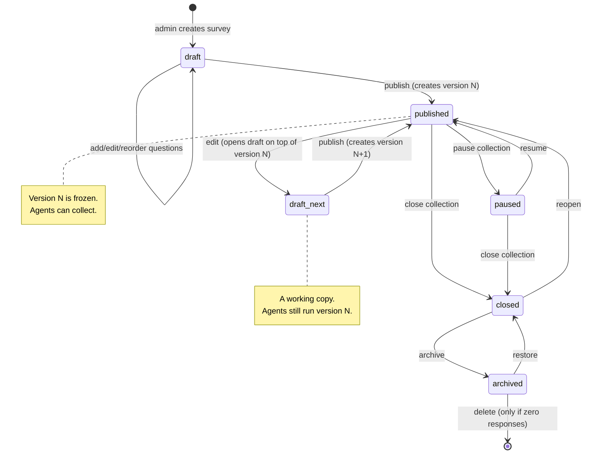
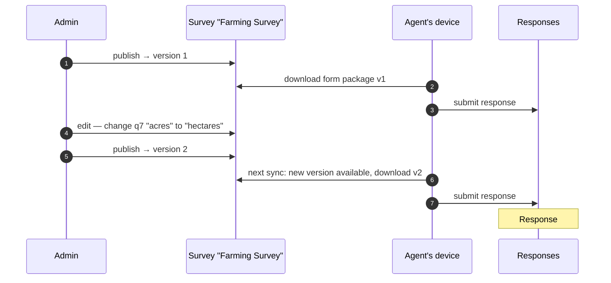
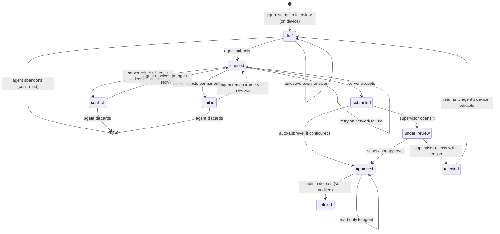

# Survey and response lifecycles

> **Audience & scope.** Product owners and engineers. Defines the two state machines the whole product turns on — the survey's, and the response's — plus the versioning rule that keeps historical data honest. Requirements are in [`FUNCTIONAL_SPEC.md`](./FUNCTIONAL_SPEC.md) §5 and §8; storage in [`../architecture/DATA_MODEL.md`](../architecture/DATA_MODEL.md).

## Why this document exists

Almost every serious bug in a survey platform is a lifecycle bug: a question edited while agents were mid-interview, a response counted twice because a retry created a second record, an answer that means something different than it did when it was collected. Writing the states down, and being explicit about which transitions are forbidden, is the cheapest defence available.

---

## 1. The survey lifecycle

### State definitions

| State | Agents see it? | New responses? | Editable? | Meaning |
|---|---|---|---|---|
| `draft` | No | No | Yes, freely | Being built. Has never been published. |
| `published` | Yes, if assigned | Yes | No — edits open a new draft | Live and collecting. |
| `paused` | Yes, marked paused | No | No | Temporarily stopped. Assignments intact, drafts on devices can still be finished and submitted. |
| `closed` | No | No | No | Collection is over. Data fully readable, exportable, reportable. |
| `archived` | No | No | No | Hidden from default lists. Data intact. |

### Transition rules

- **`draft → published`** runs the full pre-publish validation (FR-SURV-13) and fails loudly rather than publishing something broken.
- **`published → draft_next`** does not disturb the live version. The admin is editing a *working copy*; agents keep running version N until the moment the new one is published.
- **`published → paused`** stops new responses but **does not orphan drafts already on devices**. An agent halfway through an interview when the survey is paused can still finish and submit it. Anything else loses real fieldwork.
- **`closed → published`** (reopen) is allowed, because "we need another fifty responses" is a normal thing to happen. It does not create a new version.
- **`archived → deleted`** is permitted only when the survey has zero responses. A survey with data can be archived forever but never deleted; see FR-VER-8.

---

## 2. Versioning — the rule everything else depends on

> **Publishing freezes. Editing forks. Responses pin.**

Three sentences, and they are the difference between a dataset you can defend and one you cannot.

### What a version contains

A version is a complete, self-contained snapshot: every section, every question with its type and configuration, every choice list and choice, every logic expression. It is sufficient on its own to render the form and to interpret an answer, with no reference to the current state of the survey.

This matters because a response collected in March must still be readable in December after the survey has been edited four times.

### What pinning means

The pin is stored on the response and is never updated. Rendering a response, exporting it, or summarising it always uses its own version's structure.

### What happens to a draft response when a new version is published

Nothing, deliberately. FR-VER-7:

- A response already started on the device against version 1 **finishes on version 1**. The agent is mid-interview; changing the questions under them is worse than a slightly stale form.
- The device downloads version 2 on its next sync and uses it for responses **started afterwards**.
- If the agent has not started, but has an old package, the app tells them a newer version is available and refreshes before they begin.

The alternative — migrating an open draft to the new structure — is what produces half-answered forms with orphaned values, and is explicitly rejected.

### Cross-version reporting

Because questions are identified by a **stable code**, a summary can span versions where the code survived. The reporting layer's rule:

- Same code, same type → aggregate across versions.
- Same code, changed type or changed choice values → report per version, with a visible note that the question changed. Never silently merge "acres" with "hectares".
- Code removed in a later version → still reported for the versions that had it.

This is why FR-SURV-5 makes codes stable and FR-VER-6 offers a diff before publishing: the admin should see "you are changing the meaning of q7" before they do it, not afterwards.

---

## 3. The response lifecycle

### State definitions

| State | Where it lives | Who can change it | Notes |
|---|---|---|---|
| `draft` | The device only | The agent | Invisible to the server. Autosaved continuously. |
| `queued` | The device outbox | The sync engine | Submitted by the agent, not yet acknowledged. |
| `conflict` | The device outbox | The agent | The server refused for a reason a human must resolve — almost always a duplicate respondent. |
| `failed` | The device outbox | The agent | Permanently rejected. Retried only on explicit request. |
| `submitted` | The server | — | Accepted and stored. The default end state if review is off. |
| `under_review` | The server | Supervisor / admin | Someone is looking at it. |
| `approved` | The server | Supervisor / admin | Accepted. Counts toward targets. Read-only to the agent. |
| `rejected` | The server, mirrored to the device | Supervisor / admin, then the agent | Sent back with a required reason. |
| `deleted` | The server | Admin | Soft delete, reversible for a retention window, audited. |

### Rules worth stating explicitly

**A draft is not data.** It exists only on the device and is not counted, reported or visible to anyone but its agent. This is a privacy property as well as a simplicity one: an abandoned interview leaves no trace on the server.

**Submission is a claim, not an arrival.** `queued` is the honest state for "the agent pressed submit but the phone has no signal". The UI says "will sync when online", never "submitted", until the server confirms. Overstating this is how field teams lose trust in an app.

**Rejection returns the same response, not a new one.** FR-COLL-12. The agent's correction updates the original record, preserving its id, its original timestamps and its full history. Creating a second response would double-count the work and break the target arithmetic.

**Approval freezes the response for the agent.** After approval the agent can read but not edit. An admin can still edit with an audit trail (FR-MGMT-6), because correcting a mis-keyed number six weeks later is a real need.

**Auto-approve is a per-survey setting.** Many tenants do not want a review step at all. When review is off, `submitted` is terminal and the review states are never entered. The state machine supports both without a second code path.

---

## 4. How the two lifecycles interact

The one place they touch is the pin, and the interaction is deliberately narrow:

| Survey state | Can an agent start a response? | Can they submit a queued one? | Are existing responses readable? |
|---|---|---|---|
| `draft` | No | n/a | n/a |
| `published` | Yes | Yes | Yes |
| `paused` | No | **Yes** | Yes |
| `closed` | No | **Yes**, for a configurable grace window | Yes |
| `archived` | No | No — rejected as `survey_archived` | Yes |

The grace window on `closed` exists because an agent can be genuinely offline for a week. Closing a survey on Friday and rejecting the field team's Monday sync would destroy real work. The default window is 14 days after close; submissions after that are refused with a message the agent can act on, and the response stays in Sync Review rather than disappearing.

---

## 5. Worked example

*ABC Company runs its Farming Survey.*

1. **Monday.** The admin creates "Farming Survey" under the Farming category. It is `draft`. They add two sections and eleven questions, preview it, fix a typo.
2. **Tuesday.** They publish. **Version 1** is frozen. The survey is `published`. They assign it to three agents with a target of 200 and a due date of 30 September.
3. **Tuesday evening.** Agent A opens the app, downloads the form package, and drives out of coverage.
4. **Wednesday.** Agent A conducts nine interviews with no signal. Each is a local `draft`, then `queued` on submit. The sync indicator reads "Offline — 9 pending".
5. **Wednesday evening.** Signal returns. The outbox flushes: nine responses become `submitted`, pinned to version 1. Photos upload behind them.
6. **Thursday.** The admin realises question 7 asks for acres but the region reports in hectares. They edit — which opens a working draft — and publish **version 2**. Agents A, B and C are still running version 1 until their next sync.
7. **Thursday afternoon.** Agent B syncs. Their device notices version 2, downloads it, and uses it for new interviews. Their one in-progress draft finishes on version 1.
8. **Friday.** The supervisor reviews. Seven of Agent A's responses are `approved`. Two are `rejected` — one with a photo of the wrong plot, one that took 94 seconds and is flagged for duration. Both return to Agent A's device with reasons.
9. **Monday.** Agent A corrects and resubmits both. They are the same two responses, not new ones, and they retain their original collection dates.
10. **30 September.** The target is met. The admin `closes` the survey. Agent C, offline since Thursday, syncs on 2 October — inside the grace window — and their four responses are accepted.
11. **December.** An auditor asks how question 7 was worded for the nine responses collected in the first week. The pinned version answers: acres. The later ones say hectares. The export has both, in separate columns, correctly labelled.

Step 11 is the whole point of the versioning rule.

---

*Last reviewed: 2026-09-11. Source of truth: [`FUNCTIONAL_SPEC.md`](./FUNCTIONAL_SPEC.md) §5 and §8.*
